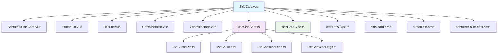

# UI组件文件结构与配套规范

基于 sideCard 组件分析结果和已定义的命名规则，本文档定义 UI 组件的标准文件结构与配套规范。

## 1. UI组件标准文件结构

### 1.1 基础目录结构

每个 UI 组件应遵循以下标准目录结构：

```
组件名称/
├── components/          # 主组件目录
│   └── [组件名称].vue   # 主组件文件
├── composables/         # 组合式函数目录
│   ├── use[组件名称].ts # 主组合式函数
│   └── use*.ts         # 子功能组合式函数
├── definitions/         # 类型定义目录
│   ├── [组件名称]Type.ts # 组件类型定义
│   └── *.ts             # 数据类型定义
├── layouts/             # 布局组件目录
│   └── Container[组件名称].vue # 布局容器组件
├── ui/                  # UI 组件目录
│   ├── [类型][名称].vue # UI 组件文件（遵循命名规则）
│   └── *.vue            # 其他 UI 组件
├── styles/              # 样式文件目录
│   ├── [组件名称].scss  # 主样式文件
│   └── *-component.scss # 组件样式文件
├── stores/              # 状态管理目录（可选）
│   └── [组件名称]Store.ts # Pinia Store
├── services/            # API服务目录（可选）
│   └── [组件名称]Service.ts # API服务
├── factories/           # 工厂模式目录（可选）
│   └── [组件名称]Registry.ts # 注册表
├── locales/             # 国际化目录（可选）
│   ├── en.json          # 英文翻译
│   └── zh.json          # 中文翻译
└── documents/           # 文档目录（可选）
    ├── design/          # 设计文档
    ├── tech/            # 技术文档
    └── readme/          # 说明文档
```

### 1.2 核心目录说明

| 目录名 | 用途 | 必需性 | 示例 |
|--------|------|--------|------|
| components | 主组件入口文件 | 必需 | SideCard.vue |
| composables | 组合式函数逻辑 | 必需 | useSideCard.ts, useButtonPin.ts |
| definitions | TypeScript 类型定义 | 必需 | sideCardType.ts |
| layouts | 布局组件 | 可选 | ContainerSideCard.vue |
| ui | UI 子组件 | 必需 | ButtonPin.vue, BarTitle.vue |
| styles | SCSS 样式文件 | 必需 | side-card.scss |
| stores | 状态管理 | 可选 | cardStore.ts |
| services | API 服务 | 可选 | cardService.ts |
| factories | 工厂模式 | 可选 | cardRegistry.ts |
| locales | 国际化 | 可选 | en.json, zh.json |

## 2. Vue 组件文件结构

### 2.1 组件文件模板结构

每个 `.vue` 文件应遵循标准的三段式结构：

```vue
<template>
  <!-- 模板部分：负责组件结构 -->
</template>

<script setup lang="ts">
// 脚本部分：负责逻辑和类型
</script>

<style lang="scss" scoped>
/* 样式部分：负责组件样式 */
</style>
```

### 2.2 模板部分规范

#### 2.2.1 命名约定
- 组件标签使用 `kebab-case`
- 事件处理使用 `@` 语法
- Props 传递使用 `:` 语法
- 插槽使用具名插槽

#### 2.2.2 结构组织
```vue
<template>
  <!-- 1. 布局容器 -->
  <layout-component :props="value" @event="handler">
    <!-- 2. 主要内容区 -->
    <div class="main-content">
      <!-- 3. 子组件调用 -->
      <ui-button :prop="value" @click="handler" />
      
      <!-- 4. 插槽定义 -->
      <slot name="content"></slot>
    </div>
    
    <!-- 5. 辅助内容区 -->
    <div v-if="condition" class="secondary-content">
      <slot name="secondary"></slot>
    </div>
  </layout-component>
</template>
```

### 2.3 脚本部分规范

#### 2.3.1 导入规则
```typescript
// 1. 布局组件导入
import ContainerComponent from './layouts/ContainerComponent.vue'

// 2. UI 组件导入
import ButtonAction from './ui/ButtonAction.vue'

// 3. 类型导入
import type { ComponentProps, ComponentEmits } from './definitions/componentType.ts'

// 4. 组合式函数导入
import { useComponent } from './composables/useComponent.ts'
```

#### 2.3.2 Props 和 Emits 定义
```typescript
// 使用预定义的类型
const props = withDefaults(defineProps<ComponentProps>(), {
  // 默认值
  id: 0,
  name: '默认名称',
  showAction: true
})

// 使用预定义的 emits 类型
const emit = defineEmits<ComponentEmits>()

// 或使用 runtime 定义
const emit = defineEmits({
  'toggle-expanded': (state: boolean) => true,
  'settings': () => true,
  'update:tags': (tags: string) => true
})
```

#### 2.3.3 组合式函数使用
```typescript
// 导入主组合式函数
import { useComponent } from './composables/useComponent.ts'

// 解构获取所有逻辑
const {
  state1, toggleState1,
  state2, updateState2,
  handler1, handler2
} = useComponent(props, emit)
```

### 2.4 样式部分规范

#### 2.4.1 SCSS 导入规则
```vue
<style lang="scss" scoped>
/* 导入主样式 */
@use '../styles/component';

/* 导入组件特定样式 */
@use '../styles/component-transition';

/* 导入通用样式 */
@use '../styles/ui-button';
</style>
```

#### 2.4.2 样式作用域
- 使用 `scoped` 属性限制样式作用域
- 全局样式使用 `:global()` 包装器
- 深度选择器使用 `:deep()` 或 `>>>`

## 3. 配套文件组织方式

### 3.1 组合式函数 (Composables)

#### 3.1.1 文件命名规则
- 前缀：`use`
- 格式：`camelCase`
- 后缀：`.ts`
- 示例：`useSideCard.ts`, `useButtonPin.ts`

#### 3.1.2 结构规范
```typescript
// 导入类型
import type { ComponentProps, ComponentEmits } from './definitions/componentType.ts'

// 导入子组合式函数
import { useSubFunction1 } from './composables/useSubFunction1.ts'
import { useSubFunction2 } from './composables/useSubFunction2.ts'

// 导出主组合式函数
export const useComponent = (props: ComponentProps, emit: ComponentEmits) => {
  
  // 1. 解构子组合式函数
  const { state1, handler1 } = useSubFunction1(props, emit)
  const { state2, handler2 } = useSubFunction2(props, emit)
  
  // 2. 本地逻辑
  const localState = ref('')
  const localHandler = () => {
    // 逻辑实现
  }
  
  // 3. 返回所有逻辑
  return {
    // 子逻辑
    state1, handler1,
    state2, handler2,
    
    // 本地逻辑
    localState, localHandler,
    
    // 计算属性
    computedValue: computed(() => {
      return state1.value + state2.value
    })
  }
}
```

### 3.2 样式文件 (Styles)

#### 3.2.1 文件命名规则
- 格式：`kebab-case`
- 后缀：`.scss`
- 示例：`side-card.scss`, `button-pin.scss`

#### 3.2.2 分类规范
```
styles/
├── [组件名称].scss           # 主样式文件
├── [组件名称]-transition.scss # 动画样式
├── [组件名称]-layout.scss     # 布局样式
├── ui-[类型].scss            # UI 通用样式
├── [组件]-[功能].scss        # 功能特定样式
└── variables.scss            # 变量定义（可选）
```

#### 3.2.3 样式组织示例
```scss
/* side-card.scss */

/* 1. 布局样式 */
.main-content {
  background: linear-gradient(
      to bottom,
      rgba(255, 255, 255, 0.7) 60%,
      rgba(255, 255, 255, 0.4)
  );
  position: relative;
  padding: 2rem 1rem 1rem;
}

/* 2. 内容区域 */
.content-wrapper {
  position: relative;
  z-index: 1;
  
  p {
    margin: 0.5rem 0;
    line-height: 1.4;
  }
}

/* 3. 响应式设计 */
@media (max-width: 768px) {
  .main-content {
    padding: 1rem 0.5rem 0.5rem;
  }
}
```

### 3.3 类型定义文件 (Definitions)

#### 3.3.1 文件命名规则
- 格式：`camelCase`
- 后缀：`Type.ts` 或 `DataType.ts`
- 示例：`sideCardType.ts`, `cardDataType.ts`

#### 3.3.2 类型组织规范
```typescript
/* sideCardType.ts */

// 1. Props 接口定义
export interface SideCardProps {
  cardId?: number
  cardType?: string
  icon?: string
  background?: string
  name?: string
  tags?: string
  description?: string
  spanColumns?: number
  initialExpanded?: boolean
  
  // 显示控制
  showIcon?: boolean
  showTitle?: boolean
  showTags?: boolean
  showSettings?: boolean
  showDeactivate?: boolean
  showClose?: boolean
  
  order?: number
}

// 2. Emits 类型定义
export type SideCardEmits = {
  (e: 'toggle-expanded', state: boolean): void
  (e: 'settings'): void
  (e: 'deactivate', id?: number): void
  (e: 'close', id?: number): void
  (e: 'left-action', action: string): void
  (e: 'update:tags', tags: string): void
  (e: 'edit', id: number): void
}

// 3. 复合类型定义
export interface SideCardData {
  id: number
  name: string
  type: string
  icon?: string
  tags: string[]
  description?: string
  isPinned: boolean
  isExpanded: boolean
  createdAt: Date
  updatedAt: Date
}
```

## 4. 文件关系图

### 4.1 组件依赖关系



### 4.2 数据流图

```
┌─────────────────────────────────────────────────────────┐
│                    父组件 (调用方)                        │
├─────────────────────────────────────────────────────────┤
│ 传递 Props                          │ 监听 Emits           │
│ • cardId                          │ • toggle-expanded   │
│ • name                            │ • settings          │
│ • tags                            │ • deactivate        │
│ • description                     │ • close             │
└─────────────────┬───────────────────┬────────────────────┘
                  │                   │
                  ▼                   ▼
┌─────────────────────────────────────────────────────────┐
│                    SideCard.vue                          │
├─────────────────────────────────────────────────────────┤
│ 1. 接收 Props                                           │
│ 2. 分发数据给子组件                                     │
│ 3. 聚合事件向上传递                                     │
│ 4. 调用 useSideCard 逻辑                               │
└─────────────────┬───────────────────┬────────────────────┘
                  │                   │
          ┌───────▼───────┐   ┌───────▼───────┐
          │ 布局组件      │   │ UI 组件       │
          │ Container     │   │ ButtonPin     │
          │ SideCard.vue  │   │ BarTitle.vue  │
          └───────┬───────┘   └───────┬───────┘
                  │                   │
          ┌───────▼───────┐   ┌───────▼───────┐
          │ 组合式函数    │   │ 样式文件      │
          │ useContainer  │   │ side-card.scss│
          │ SideCard.ts   │   │ button-pin.scss│
          └───────────────┘   └───────────────┘
```

## 5. 基于 sideCard 的实际示例

### 5.1 完整目录结构示例

**示例 1: sideCard 组件结构**
```
sideCard/
├── avatar/
│   └── Avatar.vue
├── components/
│   └── SideCard.vue
├── composables/
│   ├── useBarDescription.ts
│   ├── useBarTitle.ts
│   ├── useButtonChangeBackground.ts
│   ├── useButtonChangeIcon.ts
│   ├── useButtonClose.ts
│   ├── useButtonDeactivate.ts
│   ├── useButtonEdit.ts
│   ├── useButtonExpand.ts
│   ├── useButtonPin.ts
│   ├── useContainerIcon.ts
│   ├── useContainerSideCard.ts
│   ├── useContainerTags.ts
│   ├── useSideCard.ts
│   └── useSideCardUpload.ts
├── definitions/
│   ├── cardDataType.ts
│   ├── cardType.ts
│   └── sideCardType.ts
├── layouts/
│   └── ContainerSideCard.vue
├── ui/
│   ├── BarDescription.vue
│   ├── BarTitle.vue
│   ├── ButtonChangeBackground.vue
│   ├── ButtonChangeIcon.vue
│   ├── ButtonClose.vue
│   ├── ButtonDeactivate.vue
│   ├── ButtonEdit.vue
│   ├── ButtonExpand.vue
│   ├── ButtonPin.vue
│   ├── ContainerIcon.vue
│   └── ContainerTags.vue
├── styles/
│   ├── button-expand.scss
│   ├── button-pin.scss
│   ├── column-component.scss
│   ├── container-side-card.scss
│   ├── container-tags.scss
│   ├── side-card-transition.scss
│   ├── side-card.scss
│   ├── ui-button.scss
│   ├── ui-icon.scss
│   └── ui-text.scss
├── stores/
│   └── cardStore.ts
├── services/
│   └── cardService.ts
├── factories/
│   ├── cardRegistry.ts
│   ├── cardRegistryHelper.ts
│   └── cardRegistryLoader.ts
├── locales/
│   ├── en.json
│   └── zh.json
└── documents/
    ├── design/
    ├── tech/
    └── readme/
```

**示例 2: 简单 UI 组件结构**
```
button/
├── components/
│   └── Button.vue
├── composables/
│   └── useButton.ts
├── definitions/
│   └── buttonType.ts
├── ui/
│   └── IconButton.vue
├── styles/
│   ├── button.scss
│   ├── button-variants.scss
│   └── button-sizes.scss
└── __tests__/
    └── Button.spec.ts
```

### 5.2 具体文件示例

#### 5.2.1 SideCard.vue 示例

**文件位置**: [SideCard.vue](file:///d:/YTLA/ytla_plan_vue/src/core/classic/cards/sideCard/components/SideCard.vue)

```vue
<template>
  <container-side-card :span-columns="spanColumns" :container-style="containerStyle" :is-pinned="isPinned" :is-expanded="isExpanded" :handle-drag-start="handleDragStart" :handle-drag-end="handleDragEnd">
    <!-- 主显示区 -->
    <div class="main-content">
      <!-- 左上角按钮区 -->
      <div class="column-action-top --left">
        <button-pin :is-pinned="isPinned" :toggle-pin="togglePin" />
        
        <button-change-icon :show-icon="showIcon" :trigger-icon-upload="triggerIconUpload" />
        <input ref="iconUploadInput" type="file" accept="image/*" hidden @change="handleIconUpload" />
        
        <button-change-background :trigger-bg-upload="triggerBgUpload" />
        <input ref="bgUploadInput" type="file" accept="image/*" hidden @change="handleBgUpload" />
        
        <slot name="top-left-actions"></slot>
      </div>
      
      <!-- 右上角按钮区 -->
      <div class="column-action-top --right">
        <button-edit :show-settings="showSettings" :card-id="cardId" :handle-edit="handleEdit" />
        
        <button-deactivate :show-deactivate="showDeactivate" :handle-deactivate="handleDeactivate" />
        
        <button-close :show-close="showClose" :handle-close="handleClose" />
        
        <slot name="top-actions"></slot>
      </div>
      
      <!-- 主内容区 -->
      <div class="content-wrapper">
        <div class="header">
          <container-icon :full-icon-path="fullIconPath" :show-icon="showIcon" :handle-icon-error="handleIconError" :remove-icon="removeIcon" />
          
          <bar-title :show-title="showTitle" :name="name" :title-ref="titleRef" :is-title-editable="isTitleEditable" :start-edit-title="startEditTitle" :handle-title-blur="handleTitleBlur" :cancel-edit-title="cancelEditTitle" />
        </div>
        
        <!-- tag区域 -->
        <container-tags :show-tags="showTags" :tags-array="tagsArray" :is-adding-tag="isAddingTag" :new-tag="newTag" :tag-input="tagInput" :should-show-add-button="shouldShowAddButton" :show-add-button="showAddButton" :start-adding-tag="startAddingTag" :add-new-tag="addNewTag" :remove-tag="removeTag" :cancel-add-tag="cancelAddTag" :handle-tag-input="handleTagInput" />
        <!-- 主内容 -->
        <slot name="card-content"></slot>
      </div>
    </div>
    
    <!-- 主按钮区 -->
    <div class="column-action-central">
      <div class="column-action-central-left">
        <slot name="left-actions-buttons"></slot>
      </div>
      
      <div class="column-action-central-right">
        <slot name="right-actions"></slot>
        <button-expand :toggle-expanded="toggleExpanded" :is-expanded="isExpanded" />
      </div>
    </div>
    
    <!-- 副内容区 -->
    <transition name="slide-fade">
      <div v-show="isExpanded" class="secondary-content">
        <bar-description :description="description" :description-ref="descriptionRef" :is-description-editable="isDescriptionEditable" :start-edit-description="startEditDescription" :handle-description-blur="handleDescriptionBlur" :cancel-edit-description="cancelEditDescription" />
        <slot name="secondary-content"></slot>
      </div>
    </transition>
  </container-side-card>
</template>

<script setup lang="ts">
import ContainerSideCard from '@/core/classic/cards/sideCard/layouts/ContainerSideCard.vue'

import ButtonPin from '@/core/classic/cards/sideCard/ui/ButtonPin.vue'
import ButtonChangeIcon from '@/core/classic/cards/sideCard/ui/ButtonChangeIcon.vue'
import ButtonChangeBackground from '@/core/classic/cards/sideCard/ui/ButtonChangeBackground.vue'

import ButtonEdit from '@/core/classic/cards/sideCard/ui/ButtonEdit.vue'
import ButtonDeactivate from '@/core/classic/cards/sideCard/ui/ButtonDeactivate.vue'
import ButtonClose from '@/core/classic/cards/sideCard/ui/ButtonClose.vue'

import ButtonExpand from '@/core/classic/cards/sideCard/ui/ButtonExpand.vue'

import ContainerIcon from '@/core/classic/cards/sideCard/ui/ContainerIcon.vue'
import BarTitle from '@/core/classic/cards/sideCard/ui/BarTitle.vue'
import BarDescription from '@/core/classic/cards/sideCard/ui/BarDescription.vue'
import ContainerTags from '@/core/classic/cards/sideCard/ui/ContainerTags.vue'

import type {
  SideCardProps,
  SideCardEmits,
} from '@/core/classic/cards/sideCard/definitions/sideCardType.ts'

const props = withDefaults(defineProps<SideCardProps>(), {
  cardId: 0,
  cardType: 'default',
  icon: '',
  background: '',
  name: '默认标题',
  tags: '',
  description: '...',
  spanColumns: 1,
  initialExpanded: false,
  showIcon: true,
  showTitle: true,
  showTags: true,
  showSettings: true,
  showDeactivate: true,
  showClose: true,
})

const emit = defineEmits<SideCardEmits>()

import { useSideCard } from '@/core/classic/cards/sideCard/composables/useSideCard.ts'

const {
    handleDragStart, handleDragEnd,
    isPinned, togglePin,
    fullIconPath, iconUploadInput, triggerIconUpload, handleIconUpload,
    containerStyle, bgUploadInput, triggerBgUpload, handleBgUpload,
    handleEdit,
    handleDeactivate,
    handleClose,
    handleIconError, removeIcon,
    titleRef, isTitleEditable, handleTitleBlur, startEditTitle, cancelEditTitle,
    descriptionRef, isDescriptionEditable, handleDescriptionBlur, startEditDescription, cancelEditDescription,
    isExpanded, toggleExpanded,
    tagsArray, isAddingTag, newTag, tagInput, shouldShowAddButton, showAddButton, startAddingTag, addNewTag, removeTag, handleTagInput, cancelAddTag,
} = useSideCard(props, emit)
</script>

<style lang="scss" scoped>
@use '../styles/side-card';
@use '../styles/side-card-transition';
@use '../styles/column-component';
</style>
```

#### 5.2.2 useSideCard.ts 示例

**文件位置**: [useSideCard.ts](file:///d:/YTLA/ytla_plan_vue/src/core/classic/cards/sideCard/composables/useSideCard.ts)

```typescript
import type { SideCardProps, SideCardEmits } from '@/core/classic/cards/sideCard/definitions/sideCardType.ts'

import { useContainerSideCard } from '@/core/classic/cards/sideCard/composables/useContainerSideCard.ts'
import { useButtonPin } from '@/core/classic/cards/sideCard/composables/useButtonPin.ts'
import { useButtonChangeIcon } from '@/core/classic/cards/sideCard/composables/useButtonChangeIcon.ts'
import { useButtonChangeBackground } from '@/core/classic/cards/sideCard/composables/useButtonChangeBackground.ts'
import { useButtonEdit} from '@/core/classic/cards/sideCard/composables/useButtonEdit.ts'
import { useButtonDeactivate } from '@/core/classic/cards/sideCard/composables/useButtonDeactivate.ts'
import { useButtonClose } from '@/core/classic/cards/sideCard/composables/useButtonClose.ts'
import { useSideCardUpload } from '@/core/classic/cards/sideCard/composables/useSideCardUpload.ts'
import { useButtonExpand } from '@/core/classic/cards/sideCard/composables/useButtonExpand.ts'
import { useContainerIcon } from '@/core/classic/cards/sideCard/composables/useContainerIcon.ts'
import { useBarTitle } from '@/core/classic/cards/sideCard/composables/useBarTitle.ts'
import { useBarDescription } from '@/core/classic/cards/sideCard/composables/useBarDescription.ts'
import { useContainerTags } from '@/core/classic/cards/sideCard/composables/useContainerTags.ts'

export const useSideCard = (props: SideCardProps, emit: SideCardEmits) => {

  // side card container
  const { isDragging, handleDragStart, handleDragEnd } = useContainerSideCard(props)

  // pin button
  const { isPinned, togglePin } = useButtonPin(props)
  // icon upload button
  const { fullIconPath, iconUploadInput, triggerIconUpload, handleIconUpload } = useButtonChangeIcon(props)
  // background upload button
  const { containerStyle, bgUploadInput, triggerBgUpload, handleBgUpload } = useButtonChangeBackground(props)
  // for upload
  const { handleFileUpload } = useSideCardUpload(props)

  // edit button
  const { handleEdit } = useButtonEdit(props, emit)
  // deactivate button
  const { handleDeactivate } = useButtonDeactivate(props, emit)
  // close button
  const { handleClose } = useButtonClose(props, emit)

  // icon container
  const { handleIconError, removeIcon } = useContainerIcon(props)
  // title bar
  const { titleRef, isTitleEditable, handleTitleBlur, startEditTitle, cancelEditTitle } = useBarTitle(props)
  // description bar
  const { descriptionRef, isDescriptionEditable, handleDescriptionBlur, startEditDescription, cancelEditDescription } = useBarDescription(props)

  // card expand button
  const { isExpanded, toggleExpanded } = useButtonExpand(props, emit)

  // tags
  const { tagsArray, isAddingTag, newTag, tagInput, shouldShowAddButton, showAddButton, startAddingTag, addNewTag, removeTag, handleTagInput, cancelAddTag } = useContainerTags(props, emit)

  return {
    // container
    handleDragStart, handleDragEnd, isDragging,
    
    // pin
    isPinned, togglePin,
    
    // icon
    fullIconPath, iconUploadInput, triggerIconUpload, handleIconUpload,
    
    // background
    containerStyle, bgUploadInput, triggerBgUpload, handleBgUpload,
    
    // buttons
    handleEdit, handleDeactivate, handleClose,
    
    // icon container
    handleIconError, removeIcon,
    
    // title
    titleRef, isTitleEditable, handleTitleBlur, startEditTitle, cancelEditTitle,
    
    // description
    descriptionRef, isDescriptionEditable, handleDescriptionBlur, startEditDescription, cancelEditDescription,
    
    // expand
    isExpanded, toggleExpanded,
    
    // tags
    tagsArray, isAddingTag, newTag, tagInput, shouldShowAddButton, showAddButton, startAddingTag, addNewTag, removeTag, handleTagInput, cancelAddTag,
    
    // upload
    handleFileUpload,
  }
}
```

#### 5.2.3 sideCardType.ts 示例

**文件位置**: [sideCardType.ts](file:///d:/YTLA/ytla_plan_vue/src/core/classic/cards/sideCard/definitions/sideCardType.ts)

```typescript
export interface SideCardProps {
  cardId?: number
  cardType?: string
  icon?: string
  background?: string
  name?: string
  tags?: string
  description?: string
  spanColumns?: number
  initialExpanded?: boolean
  showIcon?: boolean
  showTitle?: boolean
  showTags?: boolean
  showSettings?: boolean
  showDeactivate?: boolean
  showClose?: boolean
  order?: number
}

export type SideCardEmits = {
  (e: 'toggle-expanded', state: boolean): void
  (e: 'settings'): void
  (e: 'deactivate', id?: number): void
  (e: 'close', id?: number): void
  (e: 'left-action', action: string): void
  (e: 'update:tags', tags: string): void
  (e: 'edit', id: number): void
}
```

#### 5.2.4 ButtonPin.vue 示例

**文件位置**: [ButtonPin.vue](file:///d:/YTLA/ytla_plan_vue/src/core/classic/cards/sideCard/ui/ButtonPin.vue)

```vue
<template>
  <button
    class="action-button"
    @click.stop="togglePin"
    :aria-label="isPinned ? $t('classic.cards.sideCard.button_unpin') : $t('classic.cards.sideCard.button_pin')"
    :title="isPinned ? $t('classic.cards.sideCard.button_unpin') : $t('classic.cards.sideCard.button_pin')"
    :class="{ '--pinned': isPinned }"
  >
    <svg
      class="pin-button"
      viewBox="0 0 24 24"
      fill="currentColor"
      :class="{ '--pinned': isPinned }"
    >
      <path
        d="M16 12V4h1c.55 0 1-.45 1-1s-.45-1-1-1H7c-.55 0-1 .45-1 1s.45 1 1 1h1v8l-2 2v2h5.2v6h1.6v-6H18v-2l-2-2z"
      />
    </svg>
  </button>
</template>

<script setup lang="ts">
defineProps<{
  isPinned: boolean
  togglePin: () => void
}>()
</script>

<style scoped lang="scss">
@use '../styles/ui-button';
@use '../styles/button-pin';
</style>
```

## 6. 实施指南

### 6.1 新组件创建步骤

1. **确定组件范围**
   - 确定组件的主要功能
   - 识别所需的子组件
   - 规划状态管理需求

2. **创建目录结构**
   ```bash
   mkdir -p newComponent/{components,composables,definitions,ui,styles}
   ```

3. **创建类型定义**
   - 在 `definitions/` 中创建 `newComponentType.ts`
   - 定义 Props、Emits 和数据类型

4. **创建组合式函数**
   - 在 `composables/` 中创建 `useNewComponent.ts`
   - 根据需要创建子组合式函数

5. **创建样式文件**
   - 在 `styles/` 中创建主样式文件
   - 创建组件特定样式文件

6. **创建 UI 组件**
   - 在 `ui/` 中创建 UI 子组件
   - 遵循命名规则：`[类型][名称].vue`

7. **创建主组件**
   - 在 `components/` 中创建主组件
   - 整合所有子组件和逻辑

### 6.2 命名检查清单

- [ ] 组件名称使用 PascalCase
- [ ] 组合式函数使用 `use` 前缀 + camelCase
- [ ] 类型定义文件使用 `Type.ts` 或 `DataType.ts` 后缀
- [ ] 样式文件使用 kebab-case
- [ ] UI 组件遵循 `[类型][名称]` 格式
- [ ] 导入路径使用绝对路径 (@/...)

### 6.3 代码质量要求

1. **类型安全**
   - 所有 Props 和 Emits 必须定义类型
   - 避免使用 `any` 类型
   - 使用 TypeScript 严格模式

2. **代码分离**
   - 逻辑与视图分离
   - 通用逻辑提取到组合式函数
   - 样式与逻辑分离

3. **性能优化**
   - 使用 `computed` 处理派生状态
   - 使用 `watchEffect` 处理副作用
   - 避免不必要的重新渲染

4. **可维护性**
   - 文件结构清晰
   - 函数职责单一
   - 注释重要逻辑

## 7. 总结

本规范基于 sideCard 组件的实际实现，定义了 Vue 3 项目的标准文件结构与配套规范。通过遵循这些规范，可以确保：

1. **一致性**: 所有组件遵循相同的组织结构
2. **可维护性**: 清晰的目录结构和职责分离
3. **可扩展性**: 模块化设计支持功能扩展
4. **可测试性**: 分离的逻辑便于单元测试
5. **团队协作**: 统一的约定减少沟通成本

实际应用时，应根据组件复杂度和需求，适当调整目录结构，但核心原则应保持一致。