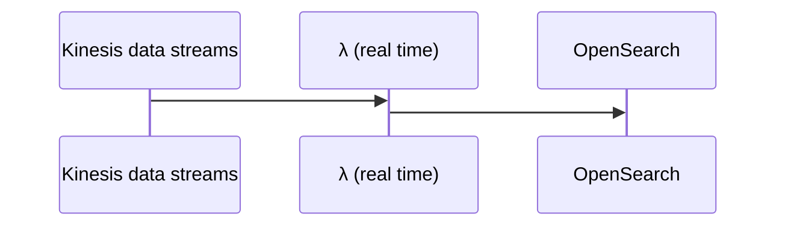
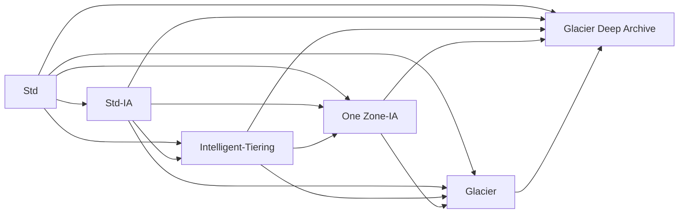

## Data Engineering 

### Create data repositories for machine learning

#### Identify data sources (e.g., content and location, primary sources such as user data) and determine storage mediums (e.g., DB, Data Lake, S3, EFS, EBS)

##### Amazon Redshift:
  * fully managed, scalable cloud data warehouse, columnar instead of row based (based on Postgres, No OLTP [row based], but OLAP [column based]); no Multi-AZ
  * As it is a data warehouse, can only store structured data
  * Offers parallel sql queries
  * Can be server less or use cluster(s)
  * Uses SQL to analyze structured and semi-structured data across data warehouses, operational DBs, and data lakes
  * Integrates with Quicksight or Tableau
  * Leader node for query planning, results aggregation
  * Compute node(s) for performing queries to be sent back to the leader
  * Provision node sizes in advance
  * Enhanced VPC Routing forces all COPY and UNLOAD traffic moving between your cluster and data repositories through your VPCs, otherwise over the internet routing, including to other AWS services
  * Can configure to automatically copy snapshots to other Regions
  * Large inserts are better (S3 copy, firehose)
  * Size limit of 2PB

##### Amazon Redshift Spectrum:
  * Resides on dedicated Amazon Redshift servers independent of your cluster
  * Can efficiently query and retrieve structured and semistructured data from files in S3 into Redshift Cluster tables (points at S3) without loading data into Redshift tables
  * Pushes many compute intensive tasks such as predicate filtering (ability to skip reading unnecessary data at storage level from a data set into RAM) and aggregation, down to the Redshift Spectrum layer
  * Redshift Spectrum queries use much less of the formal cluster's processing capacity than other queries

##### AWS RDS:
  * Autoscaling when running out of storage
  * OLTP based
  * Must be provisioned
  * Max read replicas: 5
  * Read replicas are not equal to a DB
  * Read replicas cross region/AZ incur $
  * IAM Auth
  * Integrates with Secrets Manager
  * Supports MySQL, MariaDB, Postgres, oracle, aurora
  * Fully customized => MS SQL Server or RDS Custom for Oracle => can use ssh or SSM session manager; full admin access to OS/DB
  * At rest encryption via KMS
  * Use SSL for data in transit to ensure secure access
  * Use permission boundary to control the maximum permissions employees can grant to the IAM principals (eg: to avoid dropped/deleted tables)
  * Multi-AZ: 
    * Can be set at creation or live
    * Synchronous replication, at least 2 AZs in region, while Read replicas => asynchronous replication can be in an AZ, cross-AZ or cross Region

##### Aurora:
  * MySQL or Postgres
  * OLTP based
  * Better performance than RDS version
  * Lower price
  * At rest encryption via KMS
  * 2 copies in each AZ, with a minimum of 3 AZ => 6 copies
  * max read replica: 15 (autoscales)
  * Shareable snapshots with other accounts
  * Replicas: MySQL, Postgres, or Aurora
  * Replicas can autoscale
  * Cross region replication (< 1 second) support available 
    * Aurora Global: multi region (up to 5)
    * Aurora Cloning: copy of production (faster than a snapshot)
  * Aurora multimaster (for write failover/high write availability)
  * Aurora serverless for cost effective option (pay per second) for infrequent, intermittent or unpredictable workloads
  * Non-serverless option must be provisioned
  * Automated backups
  * Automated failover with Aurora replicas 
    * Fail over tiers: lowest ranking number first, then greatest size
  * Aurora ML: ML using SageMaker and Comprehend on Aurora

##### Amazon Keyspaces (for Apache Cassandra):
  * Scalable, highly available, serverless, and managed Apache Cassandra compatible (NoSQL) DB service offering consistent single-digit millisecond server-side read/write performance, while also providing HA and data durability
  * Uses the Cassandra Query Language (CQL)
  * All writes are replicated 3x across multiple AWS AZ for durability and availability
  * Tables can scale up and down with virtually unlimited throughput and storage.  There is no limit on the size of a table or the number of rows you can store in a table.

##### Amazon DocumentDB:
  * Effectively the AWS "Aurora" version of MongoDB
  * Used to store query and index JSON data
  * Similar "deployment concepts" as Aurora
  * Fully managed, HA with replication across 3 AZs
  * Storage automatically grows in increments of 10 GB, up to 64 TB
  * Automatically scales to workloads with millions of requests per second
  * Anything related to MongoDB => DocumentDB
  * Doesn't have an in-memory caching layer => Consider DynamoDB (DAX) for a NoSQL approach

##### DynamoDB:
  * (Serverless) NoSQL Key-value / document DB that delivers single-digit millisecond performance at any scale.  It's a fully managed, multi-region, multi-master, durable DB with built-in security, backup and restore, and in-memory caching for internet scale applications
  * Stored on SSD
  * Good candidate to store ML model served by application(s)
  * Stored across 3 geographically distinct data centers
  * Eventual consistent reads (default) or strongly consistent reads (1 sec or less)
  * Session storage alternative (TTL)
  * IAM for security, authorization, and administration
  * Primary key possibilities could involve creation time
  * On-Demand (pay per request pricing) => $$$
  * Provisioned Mode (default) is less expensive where you pay for provisioned RCU/WCU
  * Backup: optionally lasts 35 days and can be used to recreate the table
  * Standard and IA Table Classes are available
  * Max size of an item in DynamoDB Table: 400KB
  * Can be exported to S3 as DynamoDB JSON or ion format
  * Can be imported from S3 as CSV, DynamoDB JSON or ion format

##### Amazon OpenSearch Service (Amazon Elasticsearch Service)
  * Service to search any field, even partial matches at petabyte scale
  * Common to use as a complement to another DB (conduct search in the service, but retrieve data based on indices from an actual DB)
  * Can receive indices to ES to enable faster searches
  * Requires a cluster of instances (can also be Multi-AZ)
  * Doesn't support SQL (own query language)
  * Comes with Opensearch dashboards (visualization)
  * Built in integrations: Amazon Data Firehose, AWS IOT, λ, Cloudwatch logs for data ingest
  * Security through Cognito and IAM, KMS encryption, SSL and VPC
  * Can help efficiently store and analyze logs (amongst cluster) for uses such as Clickstream Analytics
  * Patterns:
 ```mermaid
sequenceDiagram
    participant Kinesis data streams
    participant Amazon Data Firehose (near real time)
    participant OpenSearch
    Kinesis data streams->>Amazon Data Firehose (near real time): 
    Amazon Data Firehose (near real time)->>OpenSearch: 
    Amazon Data Firehose (near real time)->>Amazon Data Firehose (near real time): data transformation via λ
```


##### AWS Elasticache
  * Good to improve latency and throughput for read heavy applications or compute intensive workloads
  * Good for storing sessions of instances
  * Good for performance improvement of DB(s), though use of involves heavy application code changes
  * Must provision EC2 instance type(s)
  * IAM auth not supported
  * Redis versus Mem Cached:
    * Redis:
      * backup and restore features
      * read replicas to scale reads/HA
      * data durability using AOF persistence
      * multi AZ with failover 
      * Redis sorted sets are good for leaderboards
      * Redis Auth tokens enable Redis to require a token (password) before allowing clients to execute commands, thus improving security (SSL/Inflight encryption)
      * Fast in-memory data store providing sub-millisecond latency, Hippa compliant, replication, HA, and cluster sharding
    * Mem Cached:
      * Multinode partitioning of data (sharing)
      * No replication (HA)
      * Non persistence
      * No backup/restore
      * Multithreaded
      * Supports SASL auth

##### AWS Snow Family: 
  * Offline devices to perform data migrations
  * If it takes more than a week to transfer over the network, use Snow devices!

##### Snowball Edge (for data transfers)
  * Physical data transport solution: move TBs or PBs of data in or out of AWS
  * Alternative to moving data over the network (and paying network fees)
  * Pay per data transfer job with speeds up to 100 Gbit/sec
  * Provide block storage and Amazon S3-compatible object storage
  * Snowball Edge Storage Optimized - 80 TB of HDD capacity for block volume and S3 compatible object storage
  * Snowball Edge Compute Optimized - 42 TB of HDD capacity for block volume and S3 compatible object storage
  * Use cases: large data cloud migrations, decommission, disaster recovery

##### AWS Snowcone
  * Small, portable computing, anywhere, rugged & secure, withstands harsh environments
  * Light (4.5 pounds, 2.1 kg)
  * Device used for edge computing, storage, and data transfer
  * 8 TBs of usable storage
  * Use Snowcone where Snowball does not fit (space-constrained environment), though Snowball is more powerful
  * Must provide your own battery/cables
  * Can be sent back to AWS offline, or connect to internet and use AWS DataSync to send data (not as fast as Snowball)

##### AWS Snowmobile
  * Transfer exabytes of data (1 EB = 1,000 PB = 1,000,000 TBs)
  * Each Snowmobile has 100 PB of capacity (use multiple in parallel)
  * High security: temperature controlled, GPS, 24/7 video surveillance
  * Better than Snowball if you transfer more than 10 PB

##### Snow Family – Edge Computing
  * Snowcone (smaller)
  * 2 CPUs, 4 GB of memory, wired or wireless access:
    * USB-C power using a cord or the optional battery
  * Snowball Edge – Compute Optimized
    * 52 vCPUs, 208 GiB of RAM
    * Optional GPU (useful for video processing or machine learning)
    * 42 TB usable storage
  * Snowball Edge – Storage Optimized - Up to 40 vCPUs, 80 GiB of RAM
  * Object storage clustering available
  * All: 
    * Can run EC2 Instances & AWS Lambda functions (using AWS IoT Greengrass)
    * Long-term deployment options: 1 and 3 years discounted pricing

     
##### AWS DB Migration Service (AWS DMS):
  * Service to transition (no transformations) supported sources to relation DB, data warehouses, streaming platforms, and other data stores in AWS without new code (or any?)
  * Sources: 
    * On-premises and EC2 DBs: Oracle, MS SQL Server, MySQL, MariaDB, postgres, mongoDB, SAP, DB2
    * Azure: Azure SQL DB
    * Amazon RDS: all including Aurora
    * S3
  * Targets
    * On-premises and EC2 DBs: Oracle, MS SQL Server, MySQL, MariaDB, postgres, SAP
    * Amazon RDS: all including Aurora
    * Amazon Redshift
    * DynamoDB
    * S3
    * Elasticsearch service
    * Kinesis Data Streams
    * DocumentDB
  * Homogenous migration: Oracle => Oracle
  * Heteregenous: Oracle => Aurora
  * EC2 server runs replication software, as well as continuous data replication using Change Data Capture (CDC) [for new deltas] and DMS 
  * Can pre-create target tables manually or use AWS Schema Conversion Tool (SCT) [runs on the same server] to create some/all of the target tables, indices, views, etc. (only necessary for heterogeneous case)

##### Data Lake
  * Offers centralized architecture within S3
  * Can store structured, semi-structured and unstructured data
  * Decouples storage (S3) from compute resources
  * Analagous to S3, any format is permitted, but typically they are: CSV, JSON, Parquet, Orc, Avro, and Protobuf

##### Data Lake vs Data Warehouse

| Data Warehouse | Capability | Data Lake |
| ------------- | ------------- | ------------- |
| structured, processed | data | structured, semi-structured, unstructured, raw |
| schema-on-write | processing | schema-on-read |
| hierarchically archived | storage | object-based, no hierarchy |
| less agile, fixed configuration | agility | highly agile, configure and reconfigure as needed |
| mature | security | maturing |
| business professionals | users | data scientists et. al. |

##### AWS Lake Formation

  * FindMatches transform enables you to identify matching records in your dataset, even when the records do not have a common unique identifier. No fields match exactly. 
  * Can import data from MySQL, PostgreSQL, SQL Server, MariaDB, Oracle databases (Amazon RDS or EC2 based), on prem-JDBC based, or alternatively through an AWS Glue ETL if not any of the other connection types

##### S3

###### Buckets:
  * Service to allow objects/files within a virtual "directory"
  * Bucket names must be *globally unique*
  * Buckets exist within AWS regions
  * Not a file system, though if a file system is needed, EBS/EFS/FSx should be considered
  * Not mountable as is a NFS
  * Supports any file format
  * Name formalities:
    * Must not start with the prefix 'xn--'
    * Must not end with the the suffix '-s3alias'
    * Not an IP address
    * Must start with a lowercase letter or number
    * Between 3-63 characters long
    * No uppercase
    * No underscores
  * Need to be marked private to block/deny internet traffic

###### Objects/Files
   * Each has a key, it's full path within the s3 bucket including the object/file separated by backslashes ("/")
   * Each has a value, it's content
   * Note there is no such thing as a true directory within S3, but the convention effectively serves as a namespace
   * Compression is good for cost savings concerning persistence
   * Max size is 5 TB
   * If uploading > 100MB and absolutely for > 5 GB, use Multi-Part upload
   * S3 Transfer Acceleration also can be utilized to increase transfer rates (upload and download) by going through an AWS edge location that passes the object to the target S3 bucket (can work with Multi-Part upload)
   * Strong consistency model to reflect latest version/value upon write/delete to read actions
   * Version ID if versioning enabled at the bucket level
   * Metadata (list of key/val pairs)
   * Tags (Unicode key/val pair <= 10) handy for lifecycle/security
   * Endpoint offers HTTP (non encrypted) and HTTPS (encryption in flight via SSL/TLS)

###### Security (IAM principle can access if either of the policy types below allows it and there is no Deny present):
  * Types
    * User Based: governed by IAM policies (eg: which user,  within a given AWS account, via IAM should be allowed to access resources) 
    * Resource Based:
      * Bucket Policies (JSON based statements) governing such things as:
        * (Blocking) public access \[setting was created to prevent company data leaks, and can be set at the account level to ensure of inheritance]
        * Forced encryption at upload (necessitates encryption headers).  Can alternatively be done by "default encryption" via S3, though Bucket Policies are evaluated first
        * Cross account access
      * Bucket policy statement attributes 
        * SID: statement id
        * Resources: per S3, either buckets or objects
        * Effect: Allow or Deny
        * Actions: The set of api action(s) to apply the effect to
        * Principal: User/Account the policy applies to
    * Object Access Control List (ACL) - finer control of individual objects (eg: block public access)
    * Bucket Access Control List (ACL) - control at the bucket level (eg: block public access)
  * S3 Object(s) are owned by the AWS account that uploaded it, not the bucket owner
  * Settings to block public access to bucket(s)/object(s) can be set at the account level
  * S3 is accessible to other AWS resources via:
    * VPC endpoint (private connection)
      * bucket policy tied to AWS:SourceVpce (for one endpoint)
      * bucket policy tied to AWS:SourceVpc (for all possible endpoint(s))
    * Public internet via an IGW=>public ip tied to a bucket policy tied to AWS:SourceIP:
  * S3 Access Logs can be stored to another S3 bucket (not the same to prevent infinite looping)
  * Api calls can be sent to AWS CloudTrail
  * MFA Delete of object(s) within *only* versioned buckets to prevent accidental permanent deletions *[only enabled/disabled by bucket owner via CLI]*

###### S3 Storage Classes

| |Std|Intelligent Tiering|Std-IA|One Zone-IA|Glacier Instant Retrieval|Glacier Flexible Retrieval|Glacier Deep Archive|
| ------------- | ------------- | ------------- | ------------- | ------------- | ------------- | ------------- | ------------- |
| *Durability | 99.99999999999% | 99.99999999999% | 99.99999999999% | 99.99999999999% | 99.99999999999% | 99.99999999999% | 99.99999999999% |
| *Availability | 99.99% | 99.9% | 99.9% | 99.5% | 99.9% | 99.99% | 99.99% |
| *Availability SLA | 99.99% | 99% | 99% | 99% | 99% | 99.99% | 99.99% |
| *AZs | >= 3 | >= 3| >= 3 | 1 | >= 3 | >= 3 | >= 3 |
| *Min Storage Duration Charge | None | None| 30 days | 30 days | 90 days | 90 days | 180 days |
| *Min Billable Obj Size | None | None| 128 KB | 128 KB | 128 KB | 40 KB | 40 KB |
| *Retieval Fee | None | None| Per GB | Per GB | Per GB | Per GB | Per GB |
| *Storage Cost (GB per month) | .023 | .0025 - .023 | .0125 | .01 | .004 | .0036 | .00099 |
| *Retieval Cost (per 1000 requests) | GET: .0004<br />POST: .005 | GET: .0004<br />POST: .005 | GET: .001<br />POST: .01 | GET: .001<br />POST: .01 | GET: .01<br />POST: .02 | GET: .0004<br />POST: .03<br />Expediated: $10<br />Std: .05<br />Bulk: free| GET: .0004<br />POST: .05<br />Std: .10<br />Bulk: .025 |
| *Retieval Time | immediate | immediate | immediate | immediate | immediate (milliseconds) | Expediated (1-5 mins)<br />Std (3-5 hrs)<br />Bulk (5-12 hrs) | Std (12 hrs)<br />Bulk (48 hrs) |
| *Monitoring Cost (per 1000 requests) | 0 | .0025 | 0 | 0 | 0 | 0 | 0 |
\*Note: US-East-1 for the sake of example, entire table subject to change by AWS

  * Durability: How often a file is not to be lost
  * Availability: How readily S3 bucket/files are available

###### S3 Standard:
  * Used data frequently accessed
  * Provides high throughput and low latency
  * Good for mobile and gaming applications, pseudo cdn, big data/analytics

###### S3 Standard Infrequent Access
  * Good for data less frequently acessed that need immediate access
  * Cheaper than Standard
  * Good for Disaster Recovery and/or backups

###### S3 Intelligent-Tiering
  * Modest fee for monthly monitoring and auto-tiering
  * Moves objects between tiers based on usage
  * Access tiers include:
    * Frequent (automatic) default
    * Infrequent (automatic) not acessed for 30 days
    * Archive Instant (automatic) not accessed for 90 days
    * Archive (optional) configurable between 90 days to >= 700 days
    * Deep Archive (optional) configurable between 180 days to >= 700 days 

###### S3 One Zone-IA
  * Data lost when AZ is lost/destroyed
  * Good for recreateable data or on-prem data secondary backup copies

###### S3 Glacier
  * Never setup a transition to glacier classes if usage might need to be rapid
  * Good for archiving/backup
  * Glacier Instant Retrieval is a good option for accessing data once a quarter
  * Harness Glacier Vault Lock (WORM) to no longer allow future edits, which is great for compliance and data retention
  * Glacier or Deep Archive are good for infrequently accessed objects that don't need immediate access

###### S3 Lifecycle Transitions (can also be conducted manually via AWS Console)

###### S3 Lifecycle Rules
  * Transition Actions: rules for when to transtion objects between s3 classes (see S3 storage classes above)
  * Expiration Actions: rules for when to delete an object after some period of time
    * Good for deleting log files, deleting old versions of files (if versioning enabled), or incomplete multi-part uploads
  * Rules can be created for object prefixes (addresses) or associated object tags

###### S3 Analytics
  * Used to aid when moving between storage classes in S3 via Lifecycle Rules, or perhaps revise
  * One Zone-IA/Glacier classes aren't supported
  * Daily report, though takes 24-48 hours to initially start

###### S3 Data Partioning
  * Harnesses disparate key \[path] to speed up queries (eg: Athena)
  * Typical scenarios are:
    * time/date (eg: s3://bucket/datasetname/year/month/day/....)
    * product (eg: s3://bucket/datasetname/productid/...)
  * Partitioning handled by tools such as Kinesis, Glue, etc.

###### SSE-S3 S3 Encryption
  * Encryption (keys) managed by AWS (S3)
  * Encryption type of AES-256
  * Encrypted server side via HTTP/S and Header containing "x-amz-server-side-encryption":"AES256"
  * Enabled by default for new buckets and objects

###### SSE-KMS S3 Encryption
  * Encryption (KMS Customer Master Key [CMK]) managed by AWS KMS
  * Encrypted server side via HTTP/S and Header containing "x-amz-server-side-encryption":"aws:kms"
  * Offers further user control and audit trail via cloudtrail
  * May be impacted by KMS limits, though you can increase them via Service Quotas Console
    * Upload calls the GenerateDataKey KMS API (counts towards KMS quota 5500, 10000, or 30000 req/s based upon region)
    * Download calls the Decrypt KMS API (also counts towards KMS quota)

###### SSE-C S3 Encryption:
  * Server side encryption via *HTTPS only*, using a fully managed external customer key external to AWS that must be provided in the HTTP headers for every HTTP request (key isn't saved by AWS)
  * Objects encrypted with SSE-C are never replicated between S3 Buckets

###### Client Side Encryption S3 Encryption
  * Utilizes a client library such as Amazon S3 Encryption Client
  * Encrypted prior to sending to S3 and must be decrypted by clients when retrieving from S3 conducted over HTTP/S
  * Utilizes a fully managed external customer key external to AWS
  * S3 objects using SSE-C unable to be replicated between buckets

###### Encryption in transit (SSL/TLS) vs none
  * HTTP Endpoint - non-encrypted
  * HTTPS Endpoint - encrypted
  * To force encryption, a bucket policy is in order, and the following is an HTTP Get version
    * { "Version": "2012-10-17",
       "Statement": [
         {
           "Effect":"Deny",
           "Principal":"\*",
           "Action":"s3:GetObject",
           "Resource":"arn:aws:s3:::random-bucket-o-stuff/*",
           "Condition":{
             "Bool":"aws:SecureTransport":"false"
           }

         }
       ]
      }
  * To force SSE-KMS encryption
    * { "Version": "2012-10-17",
       "Statement": [
         {
           "Effect":"Deny",
           "Principal":"\*",
           "Action":"s3:PutObject",
           "Resource":"arn:aws:s3:::random-bucket-o-stuff/*",
           "Condition":{
             "StringNotEquals":{"s3:x-amz-server-side-encryption":"aws-kms"}
           }

         }
       ]
      }
  * To force SSE-C encryption
    * { "Version": "2012-10-17",
       "Statement": [
         {
           "Effect":"Deny",
           "Principal":"\*",
           "Action":"s3:PutObject",
           "Resource":"arn:aws:s3:::random-bucket-o-stuff/*",
           "Condition":{
             "Null":{"s3:x-amz-server-side-encryption-customer-algorithm":"true"}
           }

         }
       ]
      }


##### EFS: 
  * Linux based only
  * Can mount on many EC2(s)
  * Use SG control access
  * Connected via ENI
  * 10GB+ throughput
  * *Performance mode* (set at creation time): 
    * General purpose (default); latency-sensitive; use cases (web server, CMS)
    * Max I/O-higher latency, throughput, highly parallel (big data, media processing)
  * *Throughput mode*: 
    * Bursting (1 TB = 50 MiB/s and burst of up to 100 MiB/s)
    * Provisioned-set your throughput regardless of storage size (eg 1 GiB/s for 1 TB storage)
  * *Storage Classes*, Storage Tiers (lifecycle management=>move file after N days):
    * Standard: for frequently accessed files
    * Infrequent access (EFS-IA): cost to retrieve files, lower price to store
  * *Availability and durability*: 
    * Standard: multi-AZ, great for production
    * One Zone: great for development, backup enabled by default, compatible with IA (EFS One Zone-IA)

##### EBS:
  * Volumes exist on EBS => virtual hard disk
  * Snapshots exist on S3 (point in time copy of disk)
  * Snapshots are incremental-only the blocks that have changed since the last snapshot are move to S3
  * First snapshot might take more time
  * Best to stop root EBS device to take snapshots, though you don't have to
  * Provisioned IOPS (PIOPS [io1/io2])=> DB workloads/multi-attach
  * Multi-attach (EC2 =>rd/wr)=>attach the same EBS to multiple EC2 in the same AZ; up to 16 (all in the same AZ)
  * Can change volume size and storage type on the fly
  * Always in the same region as EC2
  * To move EC2 volume=>snapshot=>AMI=>copy to destination Region/AZ=>launch AMI
  * EBS snapshot archive (up to 75% cheaper to store, though 24-72 hours to restore)

##### AWS FSx:
  * Launch 3rd party high performance file system(s) on AWS
  * Can be accessed via FSx File Gateway for on-premises needs via VPN and/or Direct Connect
  * Fully managed
  * Accessible via ENI within Multi-AZ
  * Types include:
    * FSx for Windows FileServer
    * FSx for Lustre
    * FSx for Net App ONTAP (NFS, SMB, iSCSI protocols); offering:
      * Works with most OSs
      * ONTAP or NAS
      * Storage shrinks or grows
      * Compression, dedupe, snapshot replication
      * Point in time cloning
    * FSx for Open ZFS; offering:
      * Works with most OSs
      * Snapshots, compression
      * Point in time cloning

##### Amazon FSx for Windows:
  * Fully managed Windows file system share drive
  * Supports SMB and Windows NTFS
  * Microsoft Active Directory integration, ACLs, user quotas
  * Can be mounted on Linux EC2 instances
  * Scale up to 10s of GBps, millions of IOPs, 100s of PB of data
  * Storage Options:
    * SSD - latency sensitive workloads (DB, data analytics)
    * HDD - broad spectrum of workloads (home directories, CMS)
  * On-premises accessible (VPN and/or Direct Connect)
  * Can be configured to be Multi-AZ
  * Data is backed up daily to S3
  * Amazon FSx File Gateway allows native access to FSx for Windows from on-premises, local cache for frequently accessed data via Gateway

##### Amazon FSx for Lustre ("Linux" "Cluster"):
  * High performance, parallel (eg: concurrency), distributed file system designed for Applications that require fast storage to keep up with your compute such as ML, high peformance computing, video processing, Electronic Design Automation, or financial modeling
  * Integrates with linked S3 bucket(s), making it easy to process S3 objects as files and allows you to write changed data back to S3
  * Provides ability to both process 'hot data' in parallel/distributed fashion as well as easily store 'cold data' to S3
  * Storage options include SSD or HDD
  * Can be used from on-premises servers (VPN and/or Direct Connect)
  * Scratch File System can be used for temporary or burst storage use
  * Persistent File System can be used for storage / replicated with AZ

##### AWS Datasync:
  * A schedulable online data movement and discovery service that simplifies and accelerates *data migration* to AWS or *moving data* between on-premises storage, edge locations, other clouds and AWS storage (AWS to AWS, too)
  * Deployed VM AWS Datasync Agent used to convey data from internal storage (via NFS, SMB, or HDFS protocols) to the DataSync service over the internet or AWS Direct Connect to within AWS.  Agent is unnecessary for AWS to AWS
  * Directly within AWS =>S3/EFS/FSx for Windows File Server/FSx for Lustre/FSx open zfs/FSx for NetAp ONTAP
  * File permissions and metadata are preserved
  * transfers encrypted and data validation conducted