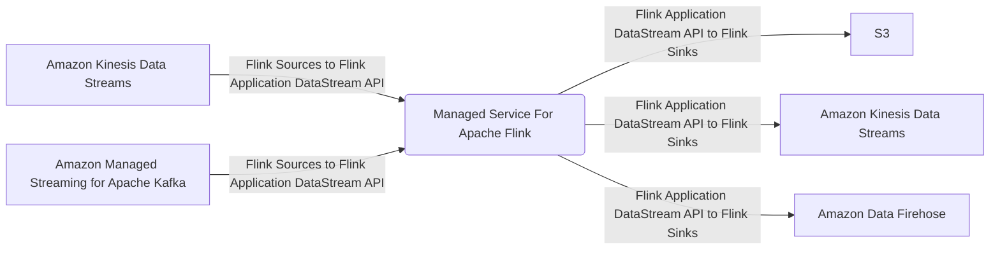

##### Amazon Managed Service for Apache Flink (formerly Amazon Kinesis Data Analytics):
  * Fully Managed (serverless; scales automatically)
  * AWS Lambda can be a destination as well
  * Allows lots of flexibility for post-processing
    * Aggregating rows
    * Translating to different formats
    * Transforming and enriching data
    * Encryption
  * Opens up access to other services & destinations
    * S3, DynamoDB, Aurora, Redshift, SNS, SQS, CloudWatch
  * Perform real-time analytics on stream via SQL
  * Can utilize λ for preprocessing (near real-time)
  * Input stream can be joined with a ref table in S3
  * Output results include streams/errors 
  * Can use either Kinesis Data Streams or Amazon Data Firehose as inputs to analyze data in kinesis (can't ingest streaming data on it's own)
  * Pay only for resources used, though that can end up not being cheap
  * Schema discovery
  * IAM permissions to access input(s)/output(s)
  * For SQL Applications: Input/Output: Kinesis Data Streams or Amazon Data Firehose to analyze data
  * Managed Apache Flink [Formerly Kinesis Data Analytics for Apache Flink or for Java (on a cluster)] :
    * Replaced Kinesis Data Analytics
    * Input: Kinesis Data Stream or Amazon MSK
    * Output: Sink (S3/Amazon Data Firehose/Kinesis Data Stream), data analysis via data analytics app, or query data stream via queries (studio notebook)
    * If output is S3, S3 Select available to query the output object(s) data
    * Managed Apache Flink provides an Apache Flink Dashboard
    * Managed Apache Flink resultant deployment by Cloud Formation contains a Flink Application (*.jar file based) and the source (Kinesis Data Stream)
    * Flink under the hood
    * Now supports Python and Scala
    * Flink is a framework for processing data streams
    * MSAF integrates Flink with AWS
      * Instead of using SQL, you can develop your own Flink application from scratch and load it into MSAF via S3
    * In addition to the DataStream API, there is a Table API for SQL access
    * Serverless
  * Use cases:
    * Streaming ETL (simple selections/translations)
    * Continuous metric generation (eg: leaderboard)
    * Responsive analytics to generate alerts when certain metrics encountered
  * ML use cases:
    * Random Cut Forest:
      * SQL function for anomaly detection on numeric columns in a stream
      * uses only recent history to generate model
    * HOTSPOTS:
      * locate and return info about relatively dense regions of data
      * uses more than only recent history

Example MSAF Flow
