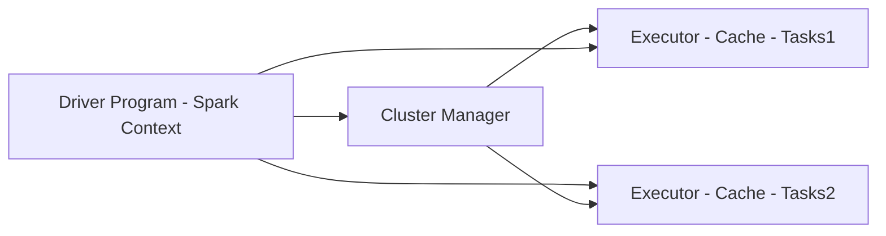

## Exploratory Data Analysis

### Data Distributions
  * Normal distribution: bell curve centered around 0
    * Probability density function: gives the probability of a data point falling within a given range of values (on a curve) with infinite possibilities (non-discrete)
  * Poisson distribution: series of discrete events that end in a success or failure, where the average number of successes over a period of time is known (count distribution).  As λ value approaches 0, distribution looks exponential
    * Probability mass function: discrete data example being a bell curve surrounding a histogram chart
  * Binomial Distribution: number of successes dealing with a binary result; discrete trials (n)
  * Bernouli Distribution: 
    * special binomial distribution
    * single trial (n=1)
    * Sum of bernouli=>binomial
   
### Types of Data
  * Numerical - quantitative measurement(s)
  * Categorical
    * yes/no, categories
    * can assign numbers to categories in order to represent them, though the numbers don't possess any real meaning
  * Ordinal: mix of numerical and categorical types (eg scale of 1 to 5), where 1 is worse than 2 and so forth with 5 being best

### Libraries to know at a high level:
  * Pandas:
    * used for slicing and mapping data (DataFrames, Series) and interoperates with numpy
    * Dataframe/Series are interchangeable with numpy arrays, though the former is often converted to the former to feed ML algorithms
  * Matplotlib (graphics might be good?)
    * boxplot (with whiskers)=>good for showing distributions and outliers
    * histograms (binning: bins of results of similar measure)=>good for showing distributions and outliers
  * Seaborn (graphics might be good?)
    * essentially Matplotlib extended
    * heatmap: demonstrates another dimension within the given plot axes
    * pairplot: good for attribute correlations
    * jointplot: scatterplot with histograms adjoining each axis
  * scikit_learn
    * toolkit for/to make ML models
    * X=>attributes
    * y=>labels
    * X and y are utilized in conjunction with the fit function to train the model(s)
    * predict function harnesses the model to output inferences based on input
    * good for preprocessing data (input data=>normal distribution \[MinMaxScaler])
      * to avoid unequal weightings, scale to the around the mean for each column, but if scales vastly different use MinMaxScaler to have values between 0 and 1
      * OrdinalEncoder to encode multi-categorical data to an int array
      * LabelBinarizer to encode binary-categorical data to 0 and 1
    * Metrics:
      * mutual_info_regression: metric used for ranking features that are continuous (display in ranked order)
      * mutual_info_classif: metric used for ranking features that are discrete targets (display in ranked order)
  * Horovod: distributed deep learning framework for TensorFlow, Keras, PyTorch, and Apache MxNet
  * Spark MLLib (see Apache Spark on EMR)

### Apache Spark on EMR
  * Hadoop consists largely of HDFS, YARN and Map Reduce
  * Hadoop Core or Hadoop - Common java archive (JAR) files/scripts used to boot Hadoop
  * YARN used to centrally manage cluster resources for different frameworks
  * Apache Spark can write output in RecordIO-protobuf format
  * Spark (faster alternative to Map Reduce)
    * Can be included within SageMaker
    * In memory cache
    * Optimized query execution on data of any size using directed acyclic graph adding efficiencies concerning dependencies/processing/scheduling
    * Java, Scala, Python, R apis available
    * Not used for OLTP or batch processing
    * Upon connecting acquires executors on nodes in the cluster that run computations and store data for your applications.  Code is sent to the executors and Spark context sends tasks to the executors to run

#### Spark Core: 
  * Foundation of the platform (memory management, fault recovery, scheduling, distributing, monitoring jobs and interactions with persistence stores)
    * Uses Resilient Distributed Dataset (RDD) at lowest level, representing a logical collection of data partitioned across nodes

##### Spark SQL
  * Up to 100x faster than Map Reduce including cost based optimizer, columnar storage and code generation for fast queries, JDBC/ODBC, JSON, HDFS, Hive, Orc, Parquet, or Hive Tables via HIVEQL
  * Exposes dataframe (python)/dataset (Scala) taking the place of RDD where input (SQL) to the spark cluster and transforms the initial query to a distributed query across the cluster

##### Spark Streaming: 
  * Data ingested via mini batches and analytics on the data is the same as application code for batch analytics for one application code for batch or streaming
  * Inputs include twitter, Kafka, Flume, HDFS, ZeroMQ, AWS Kinesis
  * Able to query unbounded table within windows of time, much like a database
  * Spark is able to query from Kinesis Data Streams via the Kinesis Client Library (KCL) 

##### Graph X: 
  * Distributed graph processing framework providing ETL, exploratory analysis, iterative graph computation to enable the building/transformation of graph data structures at scale

##### Spark MLLIB
  * Distributed and scalable via cluster nodes offering the following:
    * Classification: logistic regression, Naive Bayes (linear classifier\[s])
    * Regression
    * Decision trees
    * Recommendation engine (ALS)
    * Clustering (K-Means)
    * LDA (topic modeling), extract topics from text input(s)
    * ML workflow utilities (pipelines, feature transformation, persistence)
    * SVD, PCA, statistics
    * ALS (Alternating Least Squares)

### Spark Workflow 

### Zeppelin + Spark 
  * Can run Spark code interactively (like you can in the Spark shell) via browser (Notebook)
    * Speeds up your development cycle
    * Allows easy experimentation and exploration of your big data
  * Can execute SQL queries directly against SparkSQL
  * Query results may be visualized in charts and graphs
  * Makes Spark feel more like a data science tool!

### Jupyter Notebooks
  * runs in browser to communicate with the python environment (eg: anaconda) server
 
*from sklearn import preprocessing*

*scaler = preprocessing.standardScaler()*

*new_data = scaler.fit_transform(input)*

