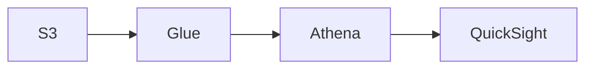

### Analyze and visualize data for machine learning
  * Graphing (scatter plot, time series, histogram, box plot)
  * Interpreting descriptive statistics (correlation, summary statistics, p value)
  * Clustering (hierarchical, diagnosing, elbow plot, cluster size)

#### Amazon Athena:
  * Serverless ad-hoc query service enabling analysis and querying of data in S3 using standard SQL, while allowing more advanced queries (joins permitted)
  * Compress data for smaller retrieval
  * Use target files (> 128 MB) to minimize overhead and as a cost savings measure
  * $5.00 per TB scanned
  * Commonly used/integrated with Amazon Quicksight
  * Federated query allows SQL queries across relational, object, non-relational, custom (AWS or on-premisis) using Data Source Connectors that run on λ with results being returned and stored in S3
  * presto under the hood
  * To integrate query with a SM endpoint, utilize USING EXTERNAL FUNCTION *given_func_name* within the query
  * supports: csv, json, orc, parquet, Auro
  * parquet or orc formats are best suited to improve query performance (eg: due to large file size) as they are splittable and compress data by default when working with Athena
  * able to query unstructured, semi-structured or structured data with in the data lake
  * use cases
    * query web logs (CloudTrail, CloudFront, VPC, ELB)
    * query data prior to loading in DB
  * can integrate with Jupiter, Zepplin, or R-Studio notebooks
  * able to integrate with other visualization tools via ODBC/JDBC protocols
  * can harness Glue Data Catalog metadata for queries
  * anti-patterns:
    * Highly formatted reports / visualization=>That's what QuickSight is for
    * ETL=>Use Glue instead
   
##### Typical pipeline use case of Athena

##### Athena Security:
  * Access control
    * IAM, ACLs, S3 bucket policies
    * AmazonAthenaFullAccess/AWSQuicksightAthenaAccess
  * Encrypt results at rest in S3 staging directory
    * Server-side encryption with S3-managed key (SSE-S3)
    * Server-side encryption with KMS key (SSE-KMS)
    * Client-side encryption with KMS key (CSE-KMS)
  * Cross-account access in S3 bucket policy possible
  * TLS encrypts in-transit (between Athena and S3)

