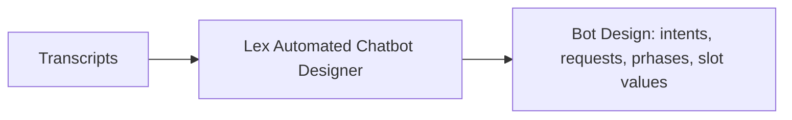
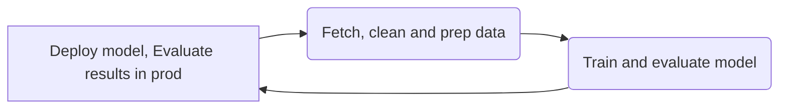
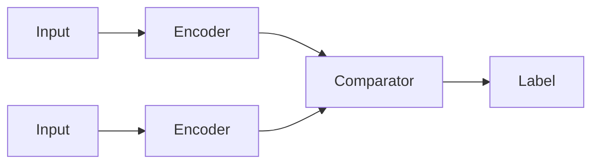

### Recommend and implement the appropriate machine learning services and features for a given problem.
#### ML on AWS (application services)

##### Amazon Polly:
  * Turn text into lifelike speech using deep learning (for talking applications)
  * Neural Text-To-Speech, many voices & languages
  * Customize pronunciation of words and phrases with pronunciation lexicons (words or phrases mapped to a certain pronunciation) that are harnessed by the Sythesize Speech Operation
  * Can map stylized words and/or acronyms to resultant output
  * Can output directely to Audio or as an audio download (mp3 or other formats)
  * Generate more customized output from text marked up with SSML including:
    * breathing, whispering
    * emphasis on words
    * phonetic pronunciation
    * speech rate, pitch, pauses
  * Speech Marks
    * Can encode when sentence / word starts and ends in the audio stream
    * Useful for lip-synching animation

##### Amazon Kendra:
  * Intelligent enterprise document search service powered by ML that allows users to search across different content repositories with built-in connectors.  Learns from user interaction/feedback for incremental learning.
  * Can return precise answers or pointers to document(s) from natural language (eg: "Where is the IT support desk?" "How do I connect to my VPN?")
  * Allows discovery of information spanning all connected data allocated in AWS (given permission) and any 3rd party connected data (salesforce, ServiceNow, SharePoint, Intranet, sharing services \[JDBC, S3], DBs, Microsoft One Drive, etc.) into one searchable repository
  * Can use other services in AWS to preprocess content to text that is searchable/indexable
  * Results can be filtered by using facets from metadata
  * Relevance tuning - boost strength of document freshness, view counts, etc.
  * Text (extracted?) from a document can't exceed 5 MB

##### Amazon Lex: 
  * ASR to convert speech to text
  * Natural language chatbot engine understanding to recognize parts of speech/text
  * Helps to build chatbots, call center bots around intents
    * Utterances invoke intents ("I want to order a pizza")
    * Lambda functions are invoked to fulfill the intent
    * Slots specify extra information needed by the intent such as pizza size, toppings, crust type, when to deliver, etc.  Note: slot is the variable, while the slot value is the value 
  * Can deploy to AWS Mobile SDK, Facebook Messenger, Slack, and Twilio

 
Amazon Lex Automated Chatbot Designer
  * You provide existing conversation transcripts
  * Lex applies NLP & deep learning, removing overlaps & ambiguity
  * Intents, user requests, phrases, values for slots are extracted
  * Ensures intents are well defined and separated
  * Integrates with Amazon Connect transcripts

##### Amazon Connect
  * Cloud-based omnichannel contact center solution for handling customer interactions through voice, chat, and messaging and used to enhance functionality/analysis/experiences. 
  * Not model based for specific (tailored) uses as is comprehend leaving analysis more open ended per input.
  * Provides several ways to access data reporting and analysis.
    * Downloading Historical Metrics Reports: reports in CSV format with a time range of up to the last 3 months
    * Analytics Data Lake:
      * Store and query contact center data.
      * Athena to query the data lake and generate reports
      * Amazon QuickSight can be used to build dashboards and visualizations from the data lake
    * Amazon Connect Service APIs: retrieve data and build real-time custom reports.
    * Streaming Contact Trace Records (CTR): stream CTR to services like Amazon Kinesis for extended retention and advanced analysis allowing integration with Amazon Athena and QuickSight, or third-party reporting applications to perform more in-depth analysis
    * Exporting Reports to Amazon S3:
      * Store various data, including call recordings, chat transcripts, and reports.
      * Can configure to automatically export reports to S3, allowing other tools access for processing 

##### Contact Lens for Amazon Connect
  * For customer support call centers
  * Ingests audio data from recorded calls
  * Transcribes in multiple languages
  * Allows search on calls / chats
  * Sentiment analysis
  * Find "utterances" that correlate with successful calls
  * Categorize calls automatically
  * Measure talk speed and interruptions
  * Monitor live and recorded conversations
  * Theme detection: discovers emerging issues, trends and themes

##### Amazon Personalize:
  * Fully managed ML service to build real-time personalized recommendations applications (same one as Amazon)
  * Service ingests via S3 (read data [purchases, ratings, impressions, cart adds, catalog, user demographics etc.]) and/or Amazon Personalize API (real-time data integration)
  * API access
    * You provide an explicit schema in Avro format
    * Javascript or SDK
    * GetRecommendations
      * Recommended products, content, etc.
      * Similar items
    * GetPersonalizedRanking
      * Rank a list of items provided
      * Allows editorial control / curation
  * Console and CLI too
  * Real-time or batch recommendations
  * Recommendations for new users and new items (the cold start problem)
  * Contextual recommendations
    * Device type, time, etc.
  * Similar items
  * Unstructured text input
  * Intelligent user segmentation
    * For marketing campaigns
  * Business rules and filters
    * Filter out recently purchased items or things that can't be shipped easily or are unavailable
    * Highlight premium content
    * Ensure a certain percentage of results are of some category
  * Promotions
    * Inject promoted content into recommendations
    * Can find most relevant promoted content
  * Trending Now
  * Personalized Rankings
    * Search results
    * Promotions
    * Curated lists

Personalize Terminology to remember
  * Datasets
    * Users, Items, Interactions
  * Recipes
    * USER_PERSONALIZATION - recommendations for a specific user and can be filtered (eg: already purchased items)
    * PERSONALIZED_RANKING - give a list of items that are ranked by an end user in a personal way, though doesn't consider history and can't be filtered
    * RELATED_ITEMS - similar items per a given item based on aggregate customer behavior
  * Solutions
    * Trains the model
    * Optimizes for relevance as well as your additional objectives
      * Video length, price, etc. - must be numeric
    * Hyperparameter Optimization (HPO)
  * Campaigns
    * Deploys your "solution version" (model that has been trained with a given set of data)
    * Deploys capacity for generating real-time recommendations

Personalize Hyperparameters
  * User-Personalization, Personalized-Ranking
    * hidden dimension (HPO) - automatically optimized for USER_PERSONALIZATION and PERSONALIZED_ RANKING; how many hidden variables are there in the underlying model
    * bptt (back-propagation through time - creates an RNN) - if time is important to recommendations; the older and event is the less significant it is; weighting more towards recent events
    * recency_mask (weights recent events) - gives more weight to recent events
    * min/max user history length_percentile (filter out robots/crawlers that have been on the site a lot or an individual who looked at one or two things)
    * exploration_weight 0-1 (.3 by default), controls relevance; higher weight=> less relevance in results and the reverse in kind (how wide a net is cast)
    * exploration_item_age_cut_off - how far back in time you go
  * Similar-items
    * item_id_hidden_dimension (HPO)
  * item_metadata_hidden_dimension (HPO with min & max range specified)

Maintaining Relevance
  * Keep your datasets current
    * Incremental data import
  * Use PutEvents operation to feed in real-time user behavior
  * Retrain the model
    * They call this a new solution version
    * Updates every 2 hours by default
    * Should do a full retrain (trainingMode=FULL) weekly

Personalize Security
  * Data not shared across accounts
  * Data may be encrypted with KMS
  * Data may be encrypted at rest in your region (SSE-S3)
  * Data in transit between your account and Amazon's internal systems encrypted with TLS 1.2
  * Access control via IAM
  * Data in S3 must have appropriate bucket policy for Amazon Personalize to process
  * Monitoring & logging via CloudWatch and CloudTrail

Personalize Pricing
  * Data ingestion: per-GB
  * Training: per training-hour
  * Inference: per TPS-hour (the more you hit the service the more you pay)
  * Batch recommendations: per user or per item

##### Amazon Augmented Al (A2I)
  * Human review of ML predictions
  * Builds workflows for reviewing low-confidence predictions
  * Access the Mechanical Turk workforce or vendors
  * Integrated into Amazon Textract and Rekognition
  * Integrates with SageMaker
  * Very similar to Ground Truth

##### Amazon Comprehend (Medical):
  * Serverless NLP service harnessing NLP to uncover valuable insights and connections in text analytics
  * Medical version detects PHI via DetectPHI API
  * Input social media, emails, web pages, documents, transcripts, medical records (Comprehend Medical)
  * PII Identification & Redaction
  * Targeted sentiment (for specific entities)
  * Can train on your own data
  * Can integrate with S3, Firehose, Lambda, Lex (eg realtime sentiment analysis), KMS, etc.
  * Results of the model are the following:
    * Events detection
    * Key phrases-noun phrases
    * Language
    * Sentiment
    * Syntax-boils down each word into a part of speech
    * Entities-nouns
      * Entity types include: COMMERCIAL_ITEM, DATE, EVENT, LOCATION, ORGANIZATION, OTHER, PERSON, QUANTITY, TITLE
      * Creating a Custom entity recognizer/recognition model can extend beyond the generic Entity types

##### Amazon Transcribe:
  * Automatically convert speech to text
    * Input in FLAC, MP3, MP4, or WAV, in a specified language
    * Streaming audio supported (WebSocket or HTTP/2 \[HTTP/2 streaming client can handle connection retries if there are intermittent network issues])
      * French, English, Spanish only
  * Uses Deep Learning - Automatic Speech Recognition (ASR)
  * Use cases:
    * Transcribe customer calls
    * Automate close captioning/subtitles
    * Generate metadata for media assets to create full scaleable architecture
  * Can remove PII using redaction
  * Supports automatic language identification for multi-lingual audio
  * Speaker Identification=>Specify number of speakers
  * Channel Identification
    * eg: two callers could be transcribed separately
    * Merging based on timing of "utterances"
  * Custom Vocabularies
    * Vocabulary Lists just a list of special words - names, acronyms, etc.
    * Vocabulary Tables (can include "SoundsLike", "IPA", and "DisplayAs")
    * Does not consider commentary context
  * Custom Language Models - designed to improve transcription accuracy for domain-specific context/speech, which would fall out of what would be considered normal everyday speech 

##### DeepLens: 
  * Deep learning-enabled video camera service
  * Integrated with Rekognition, SageMaker, Polly, Tensorflow, MXNet, Caffe

##### AWS Panorama
  * Like DeepLens
  * Computer Vision at the edge
  * Brings computer vision to your existing IP cameras, those some cameras have this built-in now
  * Results go to S3, cloudwatch, etc.

##### Amazon Rekognition:
  * Find objects, people, text, activities, scenes in images and videos using computer vision ML
  * Facial analysis and search to perform user verification, people counting
    * Create a DB of "familiar faces" or compare against celebrities
  * Images come from S3, or provide image bytes as part of request using the API
    * S3 will be faster if the image is already there
  * Facial recognition depends on good lighting, angle, visibility of eyes, resolution
  * Video must come from Kinesis Video Streams
    * H.264 encoded
    * 5-30 FPS
    * Favor resolution over framerate
  * Can use with Lambda to trigger image analysis upon upload to S3
  * Rekognition Custom Labels
    * Train with a small set of labeled images
    * Use your own labels for unique items
    * Example: the NFL uses custom labels to identify team logos, pylons, and foam fingers in images.
  * Use cases: 
    * Labeling
    * Text (in image) detection
    * Face detection and analysis (gender, emotions, age range, etc.)
    * Face search, comparison and verification
    * Celebrity recognition (with minimal development)
    * Video analysis
      * Objects / people / celebrities marked on timeline
      * Pathing (eg: for sports game analysis)
    * Content Moderation (inappropriate, unwanted, or offensive images/videos)
      * Social media/broadcast media/advertising/e-commerce
      * Confidence level of content flags/gates (threshold configuration based)
      * Flag sensitive content for manual review in A2I
      * Help comply with regulations

 ##### Amazon Textract:
   * OCR that extracts text, handwriting and data from any scanned documents (eg: forms, tables tables, etc.) using ML
   * Read from any type of document (PDFs, images, etc.)
   * Good for invoices, financial reports, medical records, insurance claims, taxforms, ids, passports

 ##### Amazon HealthScribe:
  * Speech to text from recordings, providing a conversation transcript between a patient and clinician and an automatically generated draft of clinical notes that reference said transcript
    * Speaker roles identified
    * Recognizes medical terms
    * Skips small talk and silence
  * HIPAA compliant
  * Recordings and Notes aren't stored in the cloud as a result of this service
  
##### Amazon Translate:
  * Natural and accurate language translation using deep learning
  * Allows localization of content (eg applications/websites) for international users, and to easily translate large volumes of text efficiently (input can only be text)
  * Supports custom terminology
    * CSV or TMX format
    * Appropriate for proper names, brands, etc.

##### Amazon Forecast:
  * Fully managed service using ML to deliver highly accurate forecasts (time series data)
  * 50% more accurate than looking at the data itself
  * Reduces forecasting time from months to hours
  * Use cases: Product Demand Planning, Financial Planning, Resource Planning
  * Data => S3 => Amazon Forecast => Model => Predictions
  * "AutoML" techniques chooses the best model automatically for your time series data
    * ARIMA, DeepAR, ETS, NPTS, Prophet
  * Works with any time series
    * Price, promotions, economic performance, etc.
    * Can combine with associated data to find relationships
  * Based on "dataset groups," "predictors," and "forecasts.'
  * No longer available to new customers, though perhaps still on the exam?

###### Amazon Forecast algorithms
  * CNN-QR ($$$)
    * Convolutional Neural Network - Quantile Regression
    * Best for large datasets with hundreds of time series
    * Accepts related historical time series data & metadata
  * DeepAR+ ($$$)
    * Recurrent Neural Network - AutoRegressive recurrent network
    * Best for large datasets
    * Accepts related forward-looking time series & metadata
    * Able to capture complex temporal patterns, including seasonality
    * Can automatically handle correlated time series data
  * Prophet ($$)
    * Additive model with non-linear trends and seasonality
  * NPTS ($)
    * Non-Parametric Time Series
    * Good for sparse data. Has variants for seasonal / climatological forecasts
  * ARIMA ($)
    * Autoregressive integrated moving average
    * Commonly used for simple datasets (<100 time series)
    * Not effective for complex temporal patterns (eg: Seasons) or correlations with other data
  * ETS ($)
    * Exponential Smoothing
    * Commonly used for simple datasets (<100 time series)

##### Amazon Fraud Detector
  * Upload your own historical fraud data
  * Builds custom models from a template you choose
  * Exposes an API for your online application
  * Assess risk from:
    * New accounts
    * Guest checkout
    * "Try before you buy" abuse
    * Online payments
   
##### Amazon CodeGuru
  * Automated code reviews!
  * Finds lines of code that hurt performance
  * Resource leaks, race conditions
  * Fix security vulnerabilities
  * Offers specific recommendations
  * Powered by ML
  * Supports Java and Python

##### Amazon Q Developer (formerly CodeWhisperer)
  * An "Al coding companion"
    * Java, JavaScript, Python, TypeScript, C#
  * Real-time code suggestions
    * Write a comment of what you want
    * It suggests blocks of code into your IDE
    * Based on LLMs trained on billions of lines of code
      * Amazon's code and open source code
  * Security scans
    * Analyzes code for vulnerabilities
    * Java, JavaScript, Python
  * Reference tracker
    * Flags suggestions that are similar to open source code
    * Provides annotations for proper attribution
    * Proper attribution will import the license, so you need to be aware that is allowed within your organization
  * Bias avoidance
    * Filters out code suggestions that might be biased or unfair
  * AWS service integration
    * Can suggest code for interacting with AWS APIs
      * EC2
      * Lambda
      * S3
  * Security
    * All content transmitted with TLS
    * Encrypted in transit
    * Encrypted at rest
    * However - Amazon is allowed to mine your data for individual plans
   
###### Amazon Q Developer (formerly CodeWhisperer) Pricing
  * Individual Tier
    * Free to use
    * Up to 50 security scans / month
  * Professional Tier
    * Manage which developers in an organization has access
    * Organizational policy management
      * i.e., can you use open source code?
    * Authenticated with IAM Identity Center
    * Up to 500/user/month security scans
    * $19 / user / month

###### Amazon Q Developer (formerly CodeWhisperer): Supported IDEs
  * Visual Studio Code
  * JetBrains
    * IntelliJ
    * PyCharm
    * Clion
    * GoLand
    * WebStorm
    * PhpStorm
    * RubyMine
    * DataGrip
  * JupyterLab
  * SageMaker Studio
  * AWS Lambda console
  * AWS Cloud9

##### Amazon Bedrock
  * An API for generative AI Foundation Models
    * Invoke chat, text, or image models
    * Pre-built, your own fine-tuned models, or you own models
    * Third-party models bill you through AWS via their own pricing
    * Support for RAG (Retreival-Augmented Generation)
    * Support for LLM agents
  * Serverless
  * Fine-tuning API
  * Provide labeled examples in S3 (as few as 20)
  * Your data is only used in your copy of the FM
  * Your data is encrypted and does not leave your VPC
  * Integrates with SageMaker Canvas and SM (notebooks)
  * Don't have to access model through a SM NB, but an API
  * Able to fine tune models and/or simply output results from pre-trained models
  * Model Acess must be granted before any use of base/third party models
  * IAM
    * Must use an IAM user
    * Have relevant permissions (eg: AmazonBedrockFullAccess/AmazonBedrockReadOnly)
  * Bedrock API Endpoints
    * bedrock: manage, deploy, train models
    * bedrock-runtime: inference (execute prompts, generate embeddings) against a model
      * Converse, ConverseStream, InvokeModel, InvokeModelWithResponseStream
    * bedrock-agent: manage, deploy, train LLM agents and knowledge bases
    * bedrock-agent-runtime: inference against agents and knowledge bases
      * InvokeAgent, Retrieve, RetrieveAndGenerate

##### Amazon DeepComposer
  * Al-powered keyboard
  * Composes a melody into an entire song
  * For educational purposes

##### AWS DeepRacer
  * Reinforcement learning powered 1/18-scale race car

##### Amazon Lookout
  * Equipment, metrics, vision
  * Detects abnormalities from sensor data automatically to detect equipment issues or need for maintenance 
  * Monitors metrics from S3, RDS, Redshift, 3ra party SaaS apps (eg: Salesforce)
  * Vision uses computer vision to detect defects in silicon wafers, circuit boards, etc.

##### Amazon Monitron
  * End to end system for monitoring industrial equipment & predictive maintenance

##### TorchServe 
  * Serve pytorch models
  * Model serving framework for PyTorch
  * Part of the PyTorch open source project from Facebook (Meta?)

##### AWS Neuron
  * SDK for optimizing ML inference models specifically on AWS Inferentia chips
  * By using SDK access, you can integrate with anything you care for
  * EC2 Inf1 instance type
  * Integrated with SageMaker or whatever else you want (deep learning AMIs, containers, Tensorflow, PyTorch, MXNet)

#### SageMaker

##### SageMaker Notebooks
  * Can direct the process (data preparation/preprocessing)
  * Notebook Instances are EC2 instances, running within AWS Service Accounts, that are spun up from the console
    * S3 data access (data usually comes from here)
      * Ideal format varies with algorithm - often it is RecordIO / Protobuf being the most efficient
    * Can also ingest from Athena, EMR, Redshift, and Amazon Keyspaces
    * Scikit_learn, Apache Spark, Tensorflow frameworks 
    * Wide variety of built-in models
    * Ability to spin up training instances
    * Ability to deploy trained models for making predictions at scale
  * SM Console can serve as an alternative to notebooks
  * Notebooks within SM can be opened directly via the browser
  * Can pass in parameters, they can be set to default values via the environment, variables, or directly hardcoded
  * to import and display a script in a notebook => !pygmentize xyz.py
  * if wanting to see if a model works initially perhaps only try one epoch to save time and money
  * Monitoring the progress of a NB can be done in the individual NB or through SM=>Training Jobs in the console
  * Sagemaker lifecycle configuration (LCC) can:
    * install packages or sample notebooks on a notebook instance
    * configuring, networking and security for a notebook instance
    * using a shell script to customize a notebook instance
  * Stop notebooks when not in use to not incur charges
  * Terminate session deployments when not in use to not incur charges
  * SM runs the following job types in a VPC by default
    * Processing
    * Training
    * Model hosting
    * Batch transform
    * Amazon SM Clarify
    * SM Compilation

###### SageMaker Processing
  * Processing jobs
    * Copy data from S3
    * Spin up a processing container
      * SageMaker built-in or user provided
    * Output processed data to S3

###### Training on SageMaker
  * Create a training job
    * ARN of an IAM role (RoleArn) that SM can assume to perform the (training) tasks with the proper permissions (required by built in SM algorithms)
    * URL of S3 bucket with training data
    * ML compute (CPU or GPU) and storage resources (ResourceConfig) for training (required by built in SM algorithms)
    * URL of S3 bucket for output (OutputDataConfig) of the trained model (required by built in SM algorithms)
    * ECR path to training code
    * Can't directly use ECS, this is used by AWS SM via ECR
  * Training options (conducted via SM console, SM SDK, or Jupyter NB)
    * Built-in training algorithms
      * output is of model.tar.gz format specified within an S3 bucket from the OutputDataConfig S3OutputPath of the create_training_job call
    * Spark MLLib
    * Custom Python Tensorflow / MXNet code
    * PyTorch, Scikit-Learn, RLEstimator
    * XGBoost, Hugging Face, Chainer
    * Your own Docker image (note all training code, regardless of origin, is deployed to Sagemaker harnessing instances registered and emanating from ECR)
    * Algorithm purchased from AWS marketplace

###### SM Elastic Inference 
  * Accelerates deep learning inference 
    * At fraction of cost of using a GPU instance for inference 
  * EI accelerators may be added alongside a CPU instance 
    * ml.eia1.medium / large / xlarge 
  * EI accelerators may also be applied to notebooks 
  * Works with Tensorflow, PyTorch, and MXNet pre-built containers 
    * ONNX may be used to export models to MXNet 
    * ONNX-> Used to make model compatible with an elastic interface
  * Works with custom containers built with EI- enabled Tensorflow, PyTorch, or MXNet 
  * Works with Image Classification and Object Detection built-in algorithms 
  * Must provision an AWS PrivateLink VPC Endpoint for the subnets where you plan to launch accelerators
  * Need to provide an instance role with a policy allowing user access to the instance to connect to accelerators.
  * Add elastic inference accelerator machine type alongside a CPU instance.  When you configure an instance to launch with Amazon EI, an accelerator is provisioned in the same AZ behind the VPC endpoint.
  * Note elastic interface is now deprecated, but may still appear on the exam? Apparently this is AWS Inferentia?
  * If your model supports GPU usage, this could reduce latency if utilized for inference

###### Deploying Trained Models via SageMaker
  * Save your trained model to S3
  * Can deploy two ways.
    * Persistent endpoints for making individual predictions on demand (eg: API Gateway => λ => SM Inference Model endpoint) \[uses predict function (SM SDK) or invoke_endpoint (boto3)]
    * SageMaker Batch Transform to get predictions for an entire dataset (uses transform function)
  * SageMaker deployment options
    * Inference Pipelines for more complex processing
    * SageMaker Neo for deploying to edge devices
    * Elastic Inference for accelerating deep learning models
    * Automatic scaling (increase # of endpoints as needed)
    * Shadow Testing evaluates new models against currently deployed model to catch errors
    * Inference containers use port 8080
    * Inference container routes include /ping, /invocations
    * Inference containers must respond within 2 seconds 

  * Note: ECR (aka the EC2 Container Registry) spins up instances for deployment of endpoint to make inferences in production as is needed

###### Deploying a Model via SM hosting services in 3 steps:
  * Create a model in SageMaker - By creating a model, you tell SageMaker where it can find the model components. This includes the S3 path where the model artifacts are stored and the Docker registry path for the image that contains the inference code.
  * Create an endpoint configuration for an HTTPS endpoint - You specify the name of one or more models in production variants and the ML compute instances that you want SageMaker to launch to host each production variant. SageMaker supports running (a) multiple models, (b) multiple variants of a model, or (c) combinations of models and variants on the same endpoint. Model variants can reference the same model inference container (i.e. run the same algorithm), but use different model artifacts (e.g., different model weight values based on other hyper-parameter configurations).
  * Create an HTTPS endpoint - Provide the endpoint configuration to SageMaker. The service launches the ML compute instances and deploys the model(s) as specified in the configuration.  Note a single SM endpoint can only serve one model.
  * Note: If wanting to substitute in a different model, de-register the endpoint as a scalable target. Update the endpoint using a new endpoint configuration with the latest model Amazon S3 path. Finally, register the new endpoint as a scalable target, again.

###### SM Multi-Model Endpoints
  * Can deploy large number of models
  * Use the same ML framework on a shared serving container
  * Can host both CPU or GPU based models
  * Reduces hosting costs by improving endpoint utilization with fewer resources compared with using single-model endpoints 
  * Reduces deployment overhead because Sagemaker manages loading models in memory based on traffic patterns to the endpoint
  * Endpoint usage should consider cold start-related delay penalties, though if you have models with significantly higher TPS or latency needs, a single-model endpoint might be a better fit
  * Can be used in conjunction with SM Inference pipeline
  * Can be utilized with built in SM algorithms as they have Native Support for containers

###### SM Automatic Scaling 
  * You set up a scaling policy to define target metrics, min/max capacity, cooldown periods 
  * Works with CloudWatch 
  * Dynamically adjusts number of instances for a production variant 
  * Load test your configuration before using it! 

###### SM and Availability Zones 
  * SageMaker automatically attempts to distribute instances across availability zones 
  * But you need more than one instance for this to work! 
  * Deploy multiple instances for each production endpoint 
  * Configure VPC’s with at least two subnets, each in a different AZ 

##### SM integration with Docker

  * All models in SageMaker are hosted in Docker containers
    * Pre-built deep learning
    * Pre-built scikit-learn and Spark ML
    * Pre-built Tensorflow, MXNet, Chainer, PyTorch
      * Distributed training via Horovod (tensorflow can't be distributed across multiple machines) or Parameter Servers
    * Your own training and inference code! Or extend a pre-built image.
      * To leverage gpu types, the container must be built off the compatible container (Nvidia gpu => Nvidia based docker container), note there isn't a setting for GPU support in the image
  * This allows you to use any script or algorithm within SageMaker, regardless of runtime or language 
    * Containers are isolated, and contain all dependencies and resources needed to run 

Using Docker in SM
  * Docker containers are created from images
  * Images are built from a Dockerfile
  * Can separate or combine images for training and deployment
  * Container types that don't offer network isolation (no external network access to said containers):
    * Pytorch
    * Amazon SM Reinforcment Learning
    * Scikit-learn
    * Chainer
  * Run pip install sagemaker-training=> install common functionality necessary to create containers that work with SM
  * Images are saved in a repository (All SM docker containers need to be registered in ECR) Amazon SageMaker Containers
    * Library for making containers compatible with SageMaker 
    * RUN pip install sagemaker-containers in your Dockerfile 

Structure of a training container 

/opt/ml 

|── input 

|   ├── config

|   │   ├── hyperparameters.json

|   │   └── resourceConfig.json

|   └── data

|       └── < channel_name >

|           └── \<input data>

|── model

├── code

│   └── \<script files>

│

└── output

    └── failure

Structure of a Deployment Container 

 /opt/ml
 
 └── model
 
     └── \<model files>

Docker Image Structure
  * WORKDIR 
    * nginx.conf=>front-end server configuration
    * predictor.py=>flask web server for predictions
    * serve/ =>deployment materials that launches G-unicorn server running multiple instances of the flask application detailed in predictor.py
    * train/ =>training image, code, etc.
    * wsgi.py => wrapper used to invoke flask app for serving results

Assembling it all in a Dockerfile 

FROM tensorflow/tensorflow:2.0.0a0 
RUN pip install sagemaker-containers 

\# Copies the training code inside the container

COPY train.py /opt/ml/code/train.py 

\# Defines train.py as script entrypoint

ENV SAGEMAKER_PROGRAM train.py 

Environment variables 
  * SAGEMAKER_PROGRAM=>env variable must be defined as the entrypoint, if defining your container from scratch
    * Run a script inside /opt/ml/code 
  * SAGEMAKER_TRAINING_MODULE =>load libraries and modules
  * SAGEMAKER_SERVICE_MODULE  =>load libraries and modules
  * SM_MODEL_DIR => model checkpoints are saved and pushed into S3
  * SM_CHANNELS / SM_CHANNEL_* =>where your train, test, validations channels are and what to expect in said directories
  * SM_HPS / SM_HP_* =>hyperparameters
  * SM_USER_ARGS 

Using your own image 
  * cd dockerfile
  * !docker build -t foo .
  * from sagemaker.estimator import Estimator 

        estimator = Estimator(image_name=‘foo',
                     role='SageMakerRole',
                     train_instance_count=1,
                     train_instance_type='local') 
        estimator.fit() 

Production Variants 
  * You can test out multiple models on live traffic using Production Variants 
    * Variant Weights tell SageMaker how to distribute traffic among them 
    * So, you could roll out a new iteration of your model at say 10% variant weight
    * Can test specific variants by invoking them conditionally via the TargetVariant header (eg: EU vs US traffic) 
    * Once you’re confident in its performance, ramp it up to 100% 
  * This lets you do A/B tests, and to validate performance in real- world settings 
    * Offline validation isn’t always useful
  * Shadow Variants
  * Deployment Guardrails 

  * using your own image SG
    * changes into docker dir
    * Build a docker image within SM
    * does then reference within an ESTIMATOR
    * which is then trained (fit)

##### SM integration with MLOps and Kubernetes 
  * Integrates SageMaker with Kubernetes-based ML infrastructure 
  * Enables hybrid ML workflows (on-prem + cloud) 
  * Enables integration of existing ML platforms built on Kubernetes / Kubeflow (K8s MLOps solution) 
  * SageMaker Operators for Kubernetes -wraps SM operations so K8s can utilize them via K8s API (kubectl)
    
  * SageMaker Components for Kubeflow Pipelines 
 
  * SageMaker Projects  (effectively MLOps for SM, which manages the larger pipeline for development, testing and deployment of models)
    * SageMaker Studio’s native MLOps solution with CI/CD 
    * Build images
    * Prep data, feature engineering
    * Train models
    * Evaluate models
    * Deploy models
    * Monitor & update models 
  * Uses code repositories for building & deploying ML solutions 
  * Uses SageMaker Pipelines defining steps (chain different MLOps steps together within SM)

##### SM Security

###### General SM Security 
  * Use Identity and Access Management (IAM)
    * Set up user accounts with only the permissions they need 
  * Use MFA-admin and root accounts
  * Use SSL/TLS when connecting to anything 
  * Use CloudTrail to log API and user activity 
  * Use encryption 
  * Be careful with PII
    * Encryption(at rest and in-transit)=> Both types of encryption are good for PII or sensitive info
    * Alternatively a less complex/more efficient way could be tokenization of PII fields (especially if not adding any specific value)

###### Protecting your Data at Rest in SM 
  * AWS Key Management Service (KMS) 
    * At rest encryption
    * Accepted by notebooks and all SageMaker jobs 
      * Training, tuning, batch transform, endpoints 
      * Notebooks and everything under /opt/ml/ and /tmp can be encrypted with a KMS key 
  * S3 
    * At rest and in-transit encryption
    * Can use encrypted S3 buckets for training data and hosting models 
    * S3 can also use KMS 

###### Protecting Data in Transit in SM 
  * All traffic supports TLS / SSL 
  * IAM roles are assigned to SageMaker to give it permissions to access resources 
  * Inter-node training communication may be optionally encrypted (might be necessary due to regulations)
    * Can increase training time and cost with deep learning 
    * AKA inter-container traffic encryption 
    * Enabled via console or API when setting up a training or tuning job 

###### SM integration with VPC 
  * Training jobs run in a VPC on EC2 instances within AwS Service Accounts.  
  * You can use a private VPC for even more security (note: the following are necessary for SM to work at all within a private VPC)
  * You’ll need to set up S3 VPC endpoints
  * Custom endpoint policies and S3 bucket policies can keep this secure
    * S3 bucket policies can restrict access to the given VPC endpoint and the VPC, and if the bucket is private, no public internet access
  * Notebooks are Internet-enabled by default 
    * This can be a security hole
    * If disabled, your VPC needs an interface endpoint (PrivateLink) to privately access AWS services without the internet or a NAT Gateway to allow outbound connections, for training and hosting to work
  * Training and Inference Containers are also Internet-enabled by default
    * Network isolation is an option, but this also prevents S3 access 

###### SM integration with IAM
  * User permissions for:   
    * CreateTrainingJob
    * CreateModel
    * CreateEndpointConfig   
    * CreateTransformJob 
    * CreateHyperParameterTuningJob
    * CreateNotebookInstance
    * UpdateNotebookInstance 
  * Predefined policies:
    * AmazonSageMakerReadOnly
    * AmazonSageMakerFullAccess
    * AdministratorAccess
    * DataScientist
  * Both User permissions and Predefined policies are identity policies supported by IAM
  * If using the default IAM role, and needing S3 access (eg: SM notebook instance), it is restricted to buckets with 'sagemaker' in the bucketname.  In order to access otherly named buckets, the S3FullAccess policy must be added to the role.  
  * Creation of role(s) to delegate access to 3rd party AWS accounts feasible
  * SM doesn't support resource-based policies, nor service linked roles
  * SM supports authorization based on resource tags, which can be attached to SM resources or past to SM via request(s).  To control access via tag, you add tag info in the condition element of the policy (eg: sagemaker:ResourceTag/key-name, aws:ResourceTag/key-name, or aws:TagKeys condition)

###### SM Logging and Monitoring 
  * CloudWatch can log, monitor and alarm on:
    * Invocations and latency of endpoints
    * Health of instance nodes (CPU, memory, etc)
    * Ground Truth (active workers, how much they are doing)
    * Latency metrics of OverheadLatency and ModelLatency for SM endpoint serving a single model
    * If SM training job fails without logs, ensure the S3 Training input location is correct and the training job has the correct Training Image
  * CloudTrail records actions from users, roles, and services within SageMaker 
    * Log files delivered to S3 for auditing 

##### SM Neo 
  * Train once, run anywhere 
  * compiles inference, code to work on edge devices
    * Edge devices
    * ARM, Intel, Nvidia processors
    * Embedded in any supported mobile device 
  * Optimizes code for specific devices 
    * Tensorflow, MXNet, PyTorch, ONNX, XGBoost, DarkNet, Keras 
  * Consists of a compiler and a runtime library
  * Supports image classification models exported as frozen graphs from TensorFlow, MXNet, PyTorch, or XGBoost models

###### SM Neo + AWS IoT Greengrass 
  * Neo-compiled models can be deployed to an HTTPS endpoint 
    * Hosted on C5, M5, M4, P3, or P2 instances 
    * Must be same instance type used for compilation
  * or can deploy to IoT Greengrass
    * This is how you get the model to an actual edge device 
    * Inference at the edge with local data, using model trained in the cloud
    * Uses Lambda inference applications 

##### SageMaker I/O Modes:
  * File Mode:
    * Useful for small files that fit in memory and where the algorithm has a large number of epochs
    * Can leverage the file system cache for secondary epochs, the overall I/O throughput with Pipe mode is still faster than file mode
  * Pipe Mode:
    * Recommended for large datasets
    * Overall I/O throughput with Pipe mode is still faster than file mode
    * Can stream dataset directly to your training instances where data is fed on-the-fly without using any disk I/O or downloading the complete file prior to execution. 
    * Shorter startup times because the data is being streamed instead of being downloaded to your training instances.
    * Higher I/O throughputs due to our high-performance streaming agent (no disk I/O usage).
   
#### SageMaker Ground Truth:
  * Sometimes you don't have training data at all, and it needs to be generated by humans first. (eg: training an image classification model. Somebody needs to tag a bunch of images with what they are images of before training a neural network)
  * Ground Truth manages humans who will label your data for training purposes
  * Ground Truth creates its own model as images are labeled by people
  * As this model learns, only images the model isn't sure about are sent to human labelers.
  * This can reduce the cost of labeling jobs by 70%
  * Accuracy can be improved via:
    * Annotation Consolidation: data object sent to multiple workers, stripped of outliers, and then weighted concerning more reliable results utilizing an Anotation Consolidation Algorithm (automated)
    * Annotation interface best practices; eg: provide brief instructions with positive/negative case or mask outside bounding box (automated)
    * Ground Truth label verification and adjustment involves workers verifying and correcting labels (manual)
  * human labelers include
    * Mechanical Turk
    * internal team (your company?)
    * Professional labeling companies
  * Alternatives to generate training labels (can be faster, but might be less accurate):
    * Rekognition=>Automatically classify images or videos
    * Transcribe=>Convert video/audio to text
    * Comprehend=>Automatically classify text by topics, sentiment
    * Any pre-trained model or unsupervised technique that may be helpful

#### SM Ground Truth Labels
  * Label Images:
    * Bounding Box
    * Image Semantic Segmentation
    * Auto-Segmentation Tool
    * Image Classification (Single or Multi-Label)
    * Image Label Verification
  * Label Text:
    * Named Entity Recognition
    * Text Classification (Single or Multi-Label)
  * Label Video (Frames)
    * Video Frame Object Detection
    * Video Frame Object Tracking
    * Video Frame Labeling Job Overview
  * Label 3D Point Clouds
    * 3D Point Cloud Object Detection
    * 3D Point Cloud Object Tracking
    * 3D Point Cloud Semantic Segmentation
    * 3D-2D Point Cloud Object Tracking

#### SageMaker Ground Truth Plus:
  * Turnkey solution managing the workflow and team of labelers
  * You fill out an intake form
  * They contact you and discuss pricing
  * You track progress via the Ground Truth Plus Project Portal
  * Get labeled data from S3 when done

#### Ground Truth vs A2I vs Mechanical Turk
  * Both Ground Truth and A2I are able to harnesss the Mechanical Turk workforce

#### SageMaker integration with Spark
  * Pre-process data as normal with Spark (eg: distribute computation across an entire cluster)
    * Generate DataFrames
  * Use sagemaker-spark library
  * SageMakerEstimator (takes DF following spark preprocessing to pass onto SM Algorithms and thus SM models)
    * KMeans, PCA, XGBoost
  * SageMakerModel
  * Connect notebook to a remote EMR
  * cluster running Spark (or use Zeppelin)
  * Training dataframe should have:
    * A features column that is a vector of Doubles
    * An optional labels column of Doubles
  * Call fit on your SageMakerEstimator to get a SageMakerModel
  * Call transform on the SageMakerModel to make inferences
  * Works with Spark Pipelines as well.
  * Allows you to combine pre-processing big data in Spark with training and inference in SageMaker.

#### SageMaker Data Wrangler
  * ETL Visual interface (in SageMaker Studio) to prepare data for machine learning
  * Import data
  * Data Quality and Insights Report provides a report that automatically verifies data quality imported into Data Wrangler (such as missing values, invalid values, duplicate rows, data types, and counts related therein) and helps detect anomalies (such as outliers, class imbalance, data leakage, and counts related therein) to help you clean and process your data 
  * Visualize data
  * If validating a model (without imputing), eg: a daily forecast, resample the data using the aggregate daily total to compare against.  
  * Transform data (300+ transformations to choose from)
    * Or integrate your own custom forms with pandas, PySpark, PySpark SQL
  * "Quick Model" to train your model with your data and measure its results
  * Effectively a cogeneration tool to handle transformations
  * Is not a pipeline itself, but the code it provides can go into a pipeline
  * Steps:Import=>Preview (can change data types or column names)=> Visualized data=> Transform=>"Quick Model" to analyze (data prep choices check)=> export data flow (python code)
  * Target Leakage measured via AUC-ROC (classification) or R2 (regression)
  * Inputs
    * S3
    * Athena
    * Redshift
    * Lake formation
    * SageMaker Feature Store
    * JDBC (Databricks, Saas)
  * Outputs (via a notebook)
    * SageMaker Processing
    * SageMaker Pipelines
    * SageMaker Feature Store
  * Troubleshooting
    * Make sure your Studio user has appropriate IAM roles
    * Make sure permissions on your data sources allow Data Wrangler access
      * Add AmazonSageMakerFullAccess policy to input data
    * EC2 instance limit
      * If you get "The following instance type is not available..." errors
      * May need to request a quota increase
      * Service Quotas / Amazon SageMaker / Studio KernelGateway Apps running on ml.m5.4xlarge instance

#### SageMaker ML Lineage Tracking
  * Creates & stores your ML workflow (MLOps)
  * Keep a running history of your models
  * Tracking for auditing and compliance
  * Automatically or manually-created tracking entities
  * Integrates with AWS RAM for cross-account lineage
  * Entities
    * Trial component (processing jobs, training jobs, transform jobs)
    * Trial (a model composed of trial components)
    * Experiment (a group of Trials for a given use case)
    * Context (logical grouping of entities)
    * Action (workflow step, model deployment
    * Artifact (Object or data, such as an S3 bucket or an image in ECR)
    * Association (connects entities together) - has optional Association Type:
      * Contributed To
      * AssociatedWith
      * DerivedFrom
      * Produced
      * SameAs
  * Querying Lineage Entities
    * Use the LineageQuery API from Python
      * Part of the Amazon SageMaker SDK for Python
    * Do things like find all models / endpoints / etc. that use a given artifact
    * Produce a visualization
      * Requires external Visualizer helper class
  * Sample SageMaker-created lineage graph:

#### SageMaker Clarify 
  * Tool to diagnose how features impacted most weight on predictions and resultant bias(es)
  * Pre-training Bias Metrics
    * Class Imbalance (CI)
      * One facet (demographic group) has fewer training values than another
    * Difference in Proportions of Labels (DPL)
      * Imbalance of positive outcomes between facet values
    * Kiverack-Leiber Divergence (KL), Jensen-Shannon
      * How much outcome distributions of facets diverge (E.g.: how different are loan outcomes for different demographic groups, were the actual outcomes of different groups are measured for bias)
    * Lp-norm (LP)
      * P-norm difference between distributions of outcomes from facets (E.g.: how different are loan outcomes for different demographic groups, were the actual outcomes of different groups are measured for bias)
    * Total Variation Distance (TVD)
      * L1-norm difference between distributions of outcomes from facets (E.g.: how different are loan outcomes for different demographic groups, were the actual outcomes of different groups are measured for bias)
    * Kolmogorov-Smirnov (KS) -measures outcomes and distributions, such as a Gaussian distribution of each group's outcome
      * Maximum divergence between outcomes in distributions from facets
    * Conditional Demographic Disparity (CDD)-do some groups have a larger proportion of rejections than acceptance? Effectively looking at the groups distributions to check acceptance/rejection disparities
      * Disparity of outcomes between facets as a whole, and by subgroups

#### SageMaker Serverless Inference 
  * Introduced for 2022 
  * Specify your container, memory requirement, concurrency requirements 
  * Underlying capacity is automatically provisioned and scaled 
  * Good for infrequent or unpredictable traffic; will scale down to zero when there are no requests. 
  * Charged based on usage 
  * Monitor via CloudWatch
    * ModelSetupTime, Invocations, MemoryUtilization 

#### Amazon SageMaker Inference Recommender 
  * Recommends best instance type & configuration for your models 
  * Automates load testing model tuning 
  * Deploys to optimal inference endpoint
  * How it works: 
    * Register your model to the model registry 
    * Benchmark different endpoint configurations 
    * Collect & visualize metrics to decide on instance types 
    * Existing models from zoos may have benchmarks already 
  * Instance Recommendations 
    * Runs load tests on recommended instance types 
    * Takes about 45 minutes 
  * Endpoint Recommendations 
    * Custom load test
    * You specify instances, traffic patterns, latency requirements, throughput requirements 
    * Takes about 2 hours 

#### SageMaker Inference Pipelines 
  * Linear sequence of 2-15 containers
  * Fully Managed
  * Any combination of pre-trained built-in algorithms or your own algorithms in Docker containers 
  * Combine pre-processing, predictions, post-processing 
  * Spark ML and scikit-learn containers OK
    * Spark ML can be run with Glue or EMR
    * Serialized into MLeap format 
  * Can handle both real-time inference and batch transforms 
  * chain different docker containers for different stages of the model
  * spark ML containers are serialized into MLeap format

#### SageMaker Studio
  * Visual IDE for machine learning!
  * SageMaker Notebooks
    * Create and share Jupyter notebooks with SageMaker Studio
    * Switch between hardware configurations (no infrastructure to manage)
  * SageMaker Experiments-component of SM studio
    * Organize, capture, compare, and search your ML jobs

#### SageMaker Debugger
  * Saves internal model state at periodical intervals
    * gradients / tensors / training weights / biases / neuron(s) / activation outputs over time as a model is trained
    * Define rules for detecting unwanted conditions while training
    * A debug job is run for each rule you configure
    * Logs & fires a CloudWatch event when the rule is hit
  * SageMaker Debugger Insights Dashboard
  * Integrates with SM studio via SM Studio Debugger Dashboards
  * Built-in actions to receive notifications or stop training 
    * Stop Training(), Email(), or SMS()
    * In response to Debugger Rules in SM studio integration
    * Sends notifications via SNS
  * Auto-generated training reports
  * Able to provide suggestions  through interactive visualizations  for viewing and analysis to identify the root cause(s) collected from metrics and vectors to train lighter, more efficient (eg: less neuron[s] layer[s]) and additionally cheaper model(s)
  * Real time monitoring: debug and profile data while training is ongoing to find issues early, stop training, fix issue(s), and accelerate prototyping to save time and money
  * Built-in rules:
    * Monitor system performance bottlenecks and detect training issues automatically
    * Profile model framework operations
    * Debug model parameters
  * Debugger APIs available in GitHub
    * Construct hooks & rules for CreateTrainingJob and DescribeTrainingJob APIs
      * DescribeTrainingJob is helpful to assess training failures
    * SMDebug client library lets you register hooks for accessing training data
  * Debugger ProfilerRule
    * ProfilerReport
    * Hardware system metrics (CPUBottlenck, GPUMemoryIncrease, etc)
    * Framework Metrics (MaxInitialization Time, OverallFrameworkMetrics, StepOutlier); these metrics are hyperparameters
  * Profiling system resource usage and training
  * Supported Frameworks & Algorithms:
    * Tensorflow
    * PyTorch
    * MXNet
    * XGBoost
    * SageMaker generic estimator (for use with custom training containers)

#### SageMaker Model Monitor
  * Get alerts on quality deviations, drift, etc. on your deployed models (via CloudWatch); set up via SM studio
  * Visualize data drift
    * Example: loan model starts giving people more credit due to drifting or missing input features
  * Detect anomalies & outliers
  * Detect new features
  * No code needed
  * Data is stored in S3 and secured
  * Monitoring jobs are scheduled via a Monitoring Schedule
  * Metrics are emitted to CloudWatch
    * CloudWatch notifications can be used to trigger alarms
    * You'd then take corrective action (retrain the model, audit the data)
  * Integrates with Tensorboard, QuickSight, Tableau, though visualizations can also occur within SageMaker Studio
  * Monitoring Types:
    * Drift in data quality
      * Relative to a baseline you create
      * Define and schedule data quality monitoring jobs
      * "Quality" is just statistical properties of the features
      * Integrates with Cloudwatch
      * Integrates with SM Studio, which can enable the data quality mointoring and visualize real time endpoint results
    * Drift in model quality (accuracy, etc)
      * Works the same way with a model quality baseline
      * Can integrate with Ground Truth labels (what humans say) comparing classification drift and model quality versus these attributes to alert if it diverges too much
    * Bias drift (new biases in your feature data)
    * Feature attribution drift (aka Concept drift)
      * Based on Normalized Discounted Cumulative Gain (NDCG) score
      * This compares feature ranking of training vs. live data
  * Integrates with SageMaker Clarify
    * SageMaker Clarify detects potential bias
    * Imbalances across different groups/ages/income brackets
    * With Model Monitor, you can monitor for bias and be alerted to new potential bias via CloudWatch
    * SageMaker Clarify also helps explain model behavior to understand which features contribute the most to your predictions

#### SageMaker Deployment Safeguards
  * Deployment Guardrails-when a new model is rolled out, bad performance doesn't occur
    * For asynchronous or real-time inference endpoints
    * Controls shifting traffic to new models
      * "Blue/Green Deployments"
        * All at once: shift everything, monitor, terminate blue fleet
        * Canary: shift a small portion of traffic and monitor
        * Linear: Shift traffic in linearly spaced steps
    * If a new model doesn't scale, Auto-rollbacks are there to go back to the blue fleet
  * Shadow Tests
    * Compare performance of shadow variant vs production
    * Can capture results and send them to an S3 bucket (optional)
    * You monitor performance in SageMaker console/Cloudwatch and decide when to promote it

#### SageMaker Training Compiler
  * Integrated into AWS Deep Learning Containers (DLCs)
    * Can't bring your own container
  * Compile & optimize training jobs on GPU instances
  * Can accelerate training up to 50% (dependent on how it is used)
  * Converts models into hardware-optimized instructions
  * Tested with Hugging Face transformers library, or bring your own model
  * Incompatible with SageMaker distributed training libraries
  * Best practices:
    * Ensure GPU instances are used (ml.p3, ml.p4)
    * PyTorch models must use PyTorch/XLA's model save function
    * Enable debug flag in compiler_config parameter to enable debugging

#### SageMaker Feature Store
  * A "feature" is just a property used to train a machine learning model.
    * Like, you might predict someone's political party based on "features" such as their address, income, age, etc.
  * Machine learning models require fast, secure access to feature data for training.
  * It's also a challenge to keep it organized and share features across different models.
  * Feature Store inputs could be any input you want
  * Feature Store organizes your data into feature groups with such attributes as record identifiers, feature names and event times
  * STREAMING access via PutRecord / GetRecord APIs
  * BATCH access via the offline S3 store (use with anything that hits S3, like Athena, Data Wrangler, etc. Automatically creates a Glue Data Catalog for you.)
  * Security
    * Encrypted at rest and in transit
    * Works with KMS customer master keys
    * Fine-grained access control with IAM
    * May also be secured with AWS PrivateLink

#### SageMaker Automatic Model Tuning 
  * How do you know the best values of learning rate, batch size, depth, etc?
  * Often you have to experiment
  * Problem blows up quickly when you have many different hyperparameters; need to try every combination of every possible value somehow, train a model, and evaluate it every time
  * Define the hyperparameters you care about and the ranges you want to try, and the metrics you are optimizing for
  * SageMaker spins up a "HyperParameter Tuning Job" via the SM SDK HyperParameterTuner() API that trains as many combinations as you'll allow
    * Training instances are spun up as needed (parallel), potentially a lot of them
    * If early stopping enabled and the value of the objective metric for the current training job is worse (higher when minimizing or lower when maximizing the objective metric) than the median value of running averages of the objective metric for previous training jobs up to the same epoch, SageMaker AI stops the current training job
  * The set of hyperparameters producing the best results can then be deployed as a model
  * It learns as it goes, so it doesn't have to try every possible combination
  * Best to utilizes Bayesian Search or alternatively Random Search as they both leave smaller unexplored regions than say grid search which is an option.  Random Search can be useful when the hyperparameter space is large and the relationship between settings is not well understood.  Hyperband is good with parallel jobs and early stopping so as to stop under-performing jobs and reallocate resources towards well-utilized hyperparameter configurations
  * Best Practices:
    * Don't optimize too many hyperparameters at once
    * Limit your ranges to as small a range as possible
    * Use logarithmic scales when appropriate
    * Don't run too many training jobs concurrently
      * This limits how well the process can learn as it goes (one at a time is best)
    * Make sure training jobs running on multiple instances report the correct objective metric in the end
    * If increasing from say 1 GPU to multiple GPUs (to speed up training)
      * Increase the mini-batch size by a factor of the number of GPUs to keep the mini-batch size per GPU consistent.
      * Increase the learning rate as this will increase the rate of convergence with the larger mini-batch size, since keeping the learning rate the same, the average step size is unchanged, leading to a lesser degree of step savings to converge
    * If expanding the hyperparameter range for a new hyperparameter tuning job, utilize a warm start to a hyperparameter tuning job (bayesian or random search), which utilizes information from previous hyperparameter tuning jobs to understand the best combination of hyperparameters, to increase the performance/efficiency of the new hyperparameter tuning job.
      * Other reasons to use warm start:
        * Faster than a new SM automatic hyperparameter tuning job
        * Tune a model with new data
        * Stopped a previous hyperparameter tuning job early or had it stop for whatever reason
        * Change hyperparameter ranges from a previous tuning job, edit static hyperparameters to tunable or vice versa
        * Increase the amount of training jobs spaced out of several tuning jobs per the results of said increments

#### SageMaker Autopilot
  * Automates:
    * Algorithm selection
    * Data preprocessing
    * Model tuning
    * All infrastructure
  * It does all the trial & error for you
  * More broadly this is called AutoML
  * Can add in human guidance
  * With or without code in SageMaker Studio or AWS SDKs
  * Problem types:
    * Binary classification
    * Multiclass classification
    * Regression
  * Algorithm Types:
    * Linear Learner
    * XGBoost
    * Deep Learning (MLPs)
    * Ensemble mode
  * Data must be tabular CSV or Parquet

##### SageMaker Autopilot workflow
  * Load data from S3 for training
  * Select your target column for prediction
  * Automatic model creation
  * Model notebook is available for visibility & control
  * Model leaderboard
    * Ranked list of recommended models
    * You can pick one
  * Deploy & monitor the model, refine via notebook if needed

##### SageMaker Autopilot Explainability
  * Integrates with SageMaker Clarify
  * Transparency on how models arrive at predictions
  * Feature attribution
  * Uses SHAP Baselines / Shapley Values
  * Research from cooperative game theory
  * Assigns each feature an importance value for a given prediction

#### SageMaker Canvas
  * No-code machine learning for business analysts
  * Need to set up/(manually updated) SageMaker domain=>Launch Application=>Canvas
  * Import csv data (csv only for now) into the application from S3, select a column to predict, create the model, build it, and make predictions (import files to generate predictions)
    * Quickbuild-shows an overview of the attribute weight per predictions and scoring of predicted versus actual results
    * Standard build (standard able to be shared)
  * Can also join datasets
  * Classification or regression
  * Automatic data cleaning
    * Missing values
    * Outliers
    * Duplicates
  * Share models & datasets with SageMaker Studio
  * Local file uploading must be configured "by your IT administrator."
    * Set up an S3 bucket with appropriate CORS permissions
  * Can integrate with Okta SSO
  * Import from Redshift can be set up
  * Time series forecasting must be enabled via IAM role associated with SM canvas users
  * Can run within a VPC
  * Pricing is $1.90/hr plus a charge based on number of training cells in a model
  * effectively fills the business need for the deprecated AWS Machine Learning Service

#### SM Resource Management (eg: choosing your instance type[s])
  * In general, algorithms that rely on deep learning will benefit from GPU instances (P3, g4dn) for training 
  * Inference is usually less demanding and you can often get away with compute instances there (C5) 
  * general purpose (M5) could be a good fit for training if the algorithm is not deep learning based
  * GPU instances can be really pricey; however, might be more cost-effective to have a single machine with multiple GPU than many CPU instances
  * Managed Spot Training 
    * Can use EC2 Spot instances for training
      * Save up to 90% over on-demand instances
      * Spot instances can be interrupted!
      * Use checkpoints to S3 so training can resume 
    * Can increase training time as you need to wait for spot instances to become available 

#### SageMaker Algorithms
##### Linear Learner
Usage:
  * Linear regression
    * Fit a line to your training data
    * Predications based on that line
  * Can handle both regression (numeric)predictions and classification predictions
    * For classification, a linear threshold function is used.
    * Can do binary or multi-class
    * binary classification => predicted_label of complete (1) or not complete (0)
    * multiclass classification => predicted_class of 0 to num_class - 1 and a score list of floating point numbers per class

Training input:
  * recordIO-wrapped protobuf
    * Float32 data only!
  * or CSV
    * First column assumed to be the label
    * should not have a header
  * File or Pipe mode both supported
  * Pipe mode streams from S3 -> More efficient and solves the problem of optimizing slow training

How to use:
  * Tabular data
  * Preprocessing
    * Training data must be normalized (so all features are weighted the same)
    * Linear Learner can do this for you automatically
    * Input data should be shuffled
  * Training
    * Uses stochastic gradient descent
    * Choose an optimization algorithm (Adam, AdaGrad, SGD, etc.)
    * Multiple models are optimized in parallel
    * Tune L1, L2 regularization
  * Validation
    * Most optimal model is selected during validation step

Hyperparameters:
  * predictor_type (required):binary_classifier, multiclass_classifier, or regressor
  * num_class (required if predictor_type:multiclass_classifier):3 to 1,000,000 => 3, ..., num_classes - 1
  * balance_multiclass_weights
    * Gives each class equal importance in loss functions
  * learning_rate, mini_batch_size
  * l1
    * Regularization
  * wd
    * Weight decay (L2 regularization)

Instance Types:
  * Training
    * Single or multi-machine CPU or GPU
    * Multi-GPU does not help (on one machine)

##### Seq2Seq

Usage:
  * Input is a sequence of tokens, output is a sequence of tokens
  * Machine Translation (eg: Language A => Language B, intelligent spell check)
  * Text summarization
  * Speech to text
  * Implemented with RNNs and CNNs with attention

Training input:
  * recordIO-Protobuf
    * Tokens must be integers (this is unusual, since most algorithms want floating point data.)
  * Start with tokenized text files (integers=>indices in vocabulary files for mapping purposes)
  * Convert to protobuf using sample code
    * Packs into integer tensors with vocabulary files
    * Similar to TF/IDF
  * Must provide training data, validation data, and vocabulary files.

How to use:
  * Training for machine translation can take days, even on SageMaker
  * Pre-trained models are available
  * Public training datasets are available for specific translation tasks

Hyperparameters:
  * batch_size
  * optimizer_type (adam, sgd, rmsprop)
  * learning_rate
  * num_layers_encoder
  * num_layers_decoder
  * Can optimize on:
    * Accuracy
      * Vs. provided validation dataset
    * BLEU score
      * Compares against multiple reference translations
    * Perplexity
      * Cross-entropy
    * BLEU score and perplexity are well suited for measuring machine translation problems

Instance Types:
  * Can only use GPU instance types (P3 for example)
  * Can only use a single machine for training
    * But can use multi-GPUs on one machine

##### XGBoost (eXtreme Gradient Boosting)

Usage:
  * Boosted group of decision trees
  * New trees made to correct the errors of previous trees
  * Uses gradient descent to minimize loss as new trees are added
  * Fast and popular with Kaggle competitions
  * Can be used for:
    * classification
    * regression: using regression trees
  * Good for static, non time series based attributes
 
Training input:
* XGBoost for SageMaker is just open source XGBoost
  * Takes CSV or LibSVM input (important side note: nothing currently in AWS services converts to LibSVM format)
    * CSV input
      * first column is the label
      * should not have a header
  * AWS recently extended it to accept recordIO-protobuf and Parquet

How to use:
  * Tabular data
  * Models are serialized/deserialized with Pickle
    * Can use as a framework within notebooks
      * Sagemaker.xgboost
    * Or as a built-in SageMaker algorithm-> Refer to XG boost docker image in ECR-> Deploy a fleet of training hosts for large scale jobs

Hyperparameters:
  * subsample
    * Prevents overfitting
  * num_class (required if objective hyperparameter is set to multi:softmax or multi:softprob)=>The number of classes
  * num_rounds (required): rounds to run the training
  * eta
    * Step size shrinkage, prevents overfitting
  * gamma
    * Minimum loss reduction to create a partition; larger = more conservative
  * alpha
    * L1 regularization term; larger = more conservative
  * lambda
    * L2 regularization term; larger = more conservative
  * eval_metric
    * Optimize on AUC, error, rmse...
    * For example, if you care about false positives more than accuracy, you might use AUC here
  * scale_pos_weight
    * Adjusts balance of positive and negative weights
    * Helpful for unbalanced classes
    * Might set to sum(negative cases) / sum (positive cases)
  * max_depth
    * Max depth of the tree
    * The more deep a tree is the more complicated the model is, risking overfitting

Instance Types:
  * Is memory-bound, not compute-bound
  * So, M5 is a good choice
  * As of XGBoost 1.2 single instance GPU training is available
    * For example P2, P3
    * Must set tree_method hyperparameter to gpu_hist
    * Trains more quickly and can be more cost effective.
  * XGBoost 1.2-2
    * P2, P3, G4dn, G5
  * XGBoost 1.5+: Distributed GPU training now available
    * Must set use_dask gpu_training to true 
    * Must also set tree_method hyperparameter to gpu_hist 
    * Set distribution to fully_replicated in Training nput
    * Only works with csv or parquet input

##### DeepAR Forecasting

Usage:
  * Forecasting one-dimensional time series data
  * Uses RNNs
  * Allows you to train the same model over several related time series
  * Can train over several related times series at once, not limited to single time series. Good if these multiple times series are interdependent, it can learn those relationships to create a better model to generalize to a given singular time series. 
  * Finds frequencies and seasonality
  * AR in Deep AR stands for AutoRegressive recurrent network
  * Not a fit if attributes are static, non time series based

Training input:
  * JSON lines format
    * Gzip or Parquet for better performance
  * Each record must contain:
    * Start: the starting time stamp
    * Target: the time series values
  * Each record can contain:
    * Dynamic_feat: dynamic features (such as, was a promotion applied to a product in a time series product purchases)
    * Cat: categorical features
  * Example data:
{"start": "2009-11-01 00:00:00", "target": [4.3, "NaN", 5.1, ...], "cat": [0,1], "dynamic_feat": [[1.3, 0.4, ...]]}
{"start": "2012-01-30 00:00:00","target": [4.3, "NaN", 6.1, ...], "cat": [3,5], "dynamic_feat": [[1.2, 0.6, ...]]}
{"start": "1999-01-30 00:00:00", "target": [4.3, "NaN", 7.1, ...], "cat": [2,4], "dynamic_feat": [[2.3, 0.4, ...]]}

 
How to use:
  * Tabular data
  * Always include entire time series for training, testing, and inference
  * Use entire dataset as test set, remove last time points for training. Evaluate on withheld values.
  * Don't use very large values for prediction length (> 400 data points)
  * Train on many time series and not just one when possible

Hyperparameters:
  * context_length (required)
    * Number of time points the model sees before making a prediction
    * Can be smaller than seasonalities; the model will lag one year anyhow.
  * epochs (required)
  * prediction_length (required)
  * time_freq (required)
  * mini_batch_size
  * learning_rate
  * num_cells (eg: the neurons used)

Instance Types:
  * Can use CPU or GPU
  * Single or multi machine
  * Start with CPU (ml.c4.2xlarge, ml.c4.4xlarge)
  * Move up to GPU if necessary.
    * Only helps with larger models
    * Or with large mini-batch sizes (>512)
  * CPU-only for inference
  * May need larger instances for tuning

##### BlazingText

Usage:
  * Text classification
    * Predict labels for a sentence
    * Useful in web searches, information retrieval
    * Supervised
  * Word2vec
    * Creates a vector representation of words
    * Semantically, similar words are representative vectors close to one another
    * This is called a word embedding (aka word embeddings)
    * It is usetul for NLP, but is not an NLP algorithm in itself!
      * Used in machine translation, sentiment analysis
    * Remember it only works on individual words, not sentences or documents

Training input:
  * Word2vec just wants a text file with one training sentence per line.
  * Word2vec training metric: train:mean_rho
  * For supervised mode (text classification):
    * training metric: validation:accuracy
    * need to supply labels
    * One sentence per line
    * First "word" in the sentence is the string _label_ followed by the label
  * Also "augmented manifest text format", eg:

__label__4 linux ready for prime time, intel says, despite all the linux hype, the open-source movement has yet to make a huge splash in the desktop market. that may be about to change, thanks to chipmaking giant intel corp.

__label__2 bowled by the slower one again, kolkata, november 14 the past caught up with sourav ganguly as the indian skippers return to international cricket was short lived.

  * augmented text format (Tokenized and pre-processed):

    {"source" "linux ready for prime time, intel says, despite all the linux hype", "label":1} 

    {"source":"bowled by the slower one again, kolkata, november 14 the past caught up with sourav ganguly", "label" :2}

How to use:
  * Word2vec has multiple modes
    * Cbow (Continuous Bag of Words)
    * Skip-gram =>Order of words matters
    * Batch skip-gram => Order of words matters
      * Distributed computation over many CPU nodes

Hyperparameters:
  * Word2vec:
    * mode (batch_skipgram, skipgram, cbow) \[required]
    * learning_rate
    * window_size
    * vector_dim
    * negative_samples
  * Text classification:
    * mode (supervised) \[required]
    * epochs
    * learning_rate
    * word_ngrams
    * vector_dim

Instance Types:
  * For cbow and skipgram, recommend a single ml.p3.2xlarge
    * Any single CPU or single GPU instance will work
  * For batch skipgram, can use single or multiple CPU instances
  * For text classification, C5 recommended if less than 2GB training data. For larger data sets, use a single GPU instance (ml.p2.xlarge or ml.p3.2xlarge)

##### Object2Vec

Usage:
  * Remember word2vec from Blazing Text? It's like that, but arbitrary objects
  * It creates low-dimensional dense embeddings of high-dimensional objects
  * It is basically word2vec, generalized to handle things other than words.
  * Compute nearest neighbors of objects
  * Visualize clusters
  * Genre prediction
  * Recommendations (similar items or users)

Training input:
  * Data must be tokenized into integers
  * Training data consists of pairs of tokens and/or sequences of tokens
    * Sentence - sentence
    * Labels-sequence (genre to description?)
    * Customer-customer
    * Product-product
    * User-item
  * Example input:

{"label": 0, "in0": [6, 17, 606, 19, 53, 67, 52, 12, 5, 10, 15, 10178, 7, 33, 652, 80, 15, 69, 821, 4], "in1": [16, 21, 13, 45, 14, 9, 80, 59,
164, 4]}

{"label": 1, "in0": [22, 1016, 32, 13, 25, 11, 5, 64, 573, 45, 5, 80, 15, 67, 21, 7, 9, 107, 4], "in1": [22, 32, 13, 25, 1016, 573, 3252, 4]} 

{"label": 1, "ino": [774, 14, 21, 206], "in1": [21, 366, 125]}

How to use:
  * Tabular data
  * Process data into JSON Lines and shuffle it
  * Train with two input channels, two encoders, and a comparator
  * Encoder choices:
    * Average pooled embeddings
    * Bidirectional LSTM
  * Comparator is followed by a feed-forward neural network, like so:

Hyperparameters:
  * The usual deep learning ones...
    * Dropout, early stopping, epochs, learning rate, batch size, layers, activation function, optimizer, weight decay
  * enc0_max_seq_len (required)
  * enc0_vocab_size (required)
  * enc1_network, enc2_network
    * Choose henn, bilstm, pooled embedding

Instance Types:
  * Can only train on a single machine (CPU or GPU, multi-GPU OK)
    * ml.m5.2xlarge
    * ml.p2.xlarge
    * If needed, go up to ml.m5.4xlarge or ml.m5.12xlarge
    * GPU options: P2, P3, G4dn, G5
  * Inference: use ml.p3.2xlarge
    * Use INFERENCE PREFERRED MODE environment variable to optimize for encoder embeddings rather than classification or regression.

##### Object Detectection

Usage:
  * Identify/Locate all objects in an image with bounding boxes
  * Count Objects
  * Detects and classifies objects with a single deep neural network
  * Better suited to detect multiple objects than Image Classification in an image as it provides a bounding box around class(es)
  * Not meant for Image Classification at Scale => Image Classification
  * Classes are accompanied by confidence scores
  * Can train from scratch, or use pre-trained models based on ImageNet

Training input:
  * MXNet: recordIO or image format (jpg or png)
  * Tensor flow input varies based upon the model selected
  * With image format, supply a JSON file for annotation data for each image
  * Example input:

"file": "your_image_directory/sample_image1.jpg", 
"image_size": \[
{
"width": 500,
"height": 400,
"depth": 3
}
],
"annotations": \[
{
"class_id": 0,
"left": 111,
"top": 134,
"width": 61,
"height": 128
}
],
"categories": \[
{
"class_id": 0,
"name": "dog"
}
]
}

How to use:
  * Two variants: MXNet and Tensorflow
  * Takes an image as input, outputs all instances of objects in the image with categories and confidence scores
  * MXNet
    * Uses a CNN with the Single Shot multibox Detector (SSD) Algorithm
      * The base CNN can be VGG-16 or ResNet-50
    * Transfer learning mode / incremental training
      * Use a pre-trained model for the base network weights instead of random initial weights
    * Uses flip, rescale, and jitter internally to avoid overfitting
  * Tensorflow
    * Uses ResNet, EfficientNet, MobileNet models from the TensorFlow Model Garden

Hyperparameters:
  * num_classes (required)
  * num_training_samples (required)
  * mini_batch_size
  * batch_size
  * learning_rate
  * optimizer
    * Sgd, adam, rmsprop, adadelta

Instance Types:
  * Use GPU instances for training (multi-GPU and multi-machineOK)
    * ml.p2.xlarge, ml.p2.16xlarge, ml.p3.2xlarge, ml.p3.16xlarge, G4dn, G5
  * Use CPU or GPU for inference
    * M5, P2, P3, G4dn all OK

##### Image Classification

Usage:
  * Assign one or more labels to an image
  * Utilizes a multilayer CNN
  * Doesn't tell you where objects are, just what objects are in the image
  * Not as well suited to detect multiple objects in an image as Object Detection, due to the lack of placement context

How to use:
  * Separate algorithms for MXNet and Tensorflow
  * MXNet:
    * Full training mode
      * Network initialized with random weights
    * Incremental Training
      * Seed the training of a new model with artifacts from a model that you trained previously with SM
    * Transfer learning mode
      * Initialized with pre-trained weights
      * The top fully-connected layer is initialized with random weights
      * Network is fine-tuned with new training data
    * Default image size is 3-channel 224×224 (ImageNet's dataset)
  * Tensorflow: Uses various Tensorflow Hub models (MobileNet, Inception, ResNet, EfficientNet)
    * Top classification layer is available for fine tuning or further training

Hyperparameters:
  * num_classes, num_training_samples (required for MXNET)
  * resize (required for MXNET when using image content types)
  * The usual suspects for deep learning
    * batch_size, learning_rate, optimizer
  * Optimizer-specific parameters
    * weight_decay, beta_1, beta_2, eps, gamma
    * Slightly different between MXNet and Tensorflow versions

Instance Types:
  * GPU instances for training (ml.p2, p3, g4dn, g5) Multi-GPU and multi-machine OK.
  * CPU or GPU for inference (m5, p2, p3, g4dn, g5); instance types are really ml varieties of course (ml.m5, ml.p2, etc.

##### Semantic Segmentation

Usage:
  * Pixel-level object classification
  * Different from image classification - that assigns labels to whole images
  * Different from object detection - that assigns labels to bounding boxes
  * Useful for self-driving vehicles, medical imaging diagnostics, robot sensing
  * Produces a segmentation mask, which maps individual pixels to labels or classifications

Training input:
  * JPG Images and PNG annotations
  * For both training and validation
  * Label maps to describe annotations
  * Augmented manifest image format supported for Pipe mode (for performance).
  * JPG images accepted for inference

How to use:
  * Built on MXNet Gluon and Gluon CV
  * Choice of 3 algorithms:
    * Fully-Convolutional Network (FCN)
    * Pyramid Scene Parsing (PSP)
    * DeepLabV3
  * Choice of backbones:
    * ResNet50
    * ResNet101
    * Both trained on ImageNet database
  * Incremental training, or training from scratch, supported too

Hyperparameters:
  * num_classes, num_training_samples (required)
  * epochs, learning rate, batch size, optimizer, algorithm, backbone, etc.

Instance Types:
  * Only GPU supported for training (P2, P3, G4dn, G5) on a single machine only
  * Inference on CPU (C5 or M5) or GPU (P3 or G4dn)

##### Random Cut Forest

Usage:
  * Anomaly detection
  * Unsupervised
  * Detect unexpected spikes in time series data
  * Breaks in periodicity
  * Unclassifiable data points
  * Assigns an anomaly score to each data point
  * Based on an algorithm developed by Amazon that they seem to be very proud of! and trying

Training input:
  * recordIO-protobuf or CSV ('content_type=text/csv;label_size=0')
  * Can use File or Pipe mode on either
  * Optional test channel for computing accuracy, precision, recall, and F1 on labeled data (anomaly or not)

How to use:
  * Tabular data
  * Creates a forest of trees where each tree is a partition of the training data; looks at expected change in complexity of the tree as a result of adding a point into it
  * Data is sampled randomly
  * Then trained
  * RCF shows up in Kinesis Analytics as well; it can work on streaming data too.

Hyperparameters:
  * feature_dim (required)
  * num_trees
    * Increasing reduces noise
  * num_samples_per_tree
    * Should be chosen such that 1/num_samples_per_tree approximates the ratio of anomalous to normal data

Instance Types:
  * Does not take advantage of GPUs
  * Use M4, C4, or C5 for training
  * ml.c5.xl for inference

##### Neural Topic Model

-A topic modeling algorithm
-Not really trained as it's unsupervised, so you can do a training pass, a validation, or test channel to measure performance versus known data, where you know the topics

Usage:
  * A topic modeling algorithm (like LDA)
  * Organize documents into topics
  * Classify or summarize documents based on topics
  * It's not just TF/IDF
    * "bike", "car", "train", "mileage", and "speed" might classify a document as "transportation" for example (although it wouldn't know to call it that)
  * Unsupervised
    * Algorithm is "Neural Variational Inference"

Training input:
  * Not really trained as it's unsupervised, so you can do a training pass, a validation, or test channel to measure performance versus known data, where you know the topics
  * Four data channels
    * "train" is required
    * "validation", "test", and "auxiliary" optional
  * recordlO-protobuf or CSV ('content_type=text/csv;label_size=0')
  * Words must be tokenized into integers
    * Every document must contain a count for every word in the vocabulary in CSV
    * The "auxiliary" channel is for the vocabulary
  * File or pipe mode

How to use:
  * You define how many topics you want
  * These topics are a latent representation based on top ranking words
  * One of two topic modeling algorithms in SageMaker - you can try them both!

Hyperparameters:
  * Lowering mini_batch_size and learning_rate can reduce validation loss
    * At expense of training time
  * num_topics, feature_dim (both required)

Instance Types:
  * GPU or CPU
    * GPU recommended for training
    * CPU OK for inference
    * CPU is cheaper

##### Latent Dirichlet Allocation (LDA)

Usage:
  * A topic modeling algorithm (like Neural Topic Model)
  * Not deep learning
  * Unsupervised
    * The topics themselves are unlabeled; they are just groupings of documents with a shared subset of words
    * Observations == documents
    * feature set == vocabulary
    * feature == word
    * resulting categories == topics
  * Can be used for things other than words
    * Cluster customers based on purchases
    * Harmonic analysis in music

Training input:
  * Train channel, optional test channel (to measure accuracy)
  * recordIO-protobuf or CSV ('content_type=text/csv;label_size=0')
  * Each document has counts for every word in vocabulary (in CSV format)
  * Pipe mode only supported with recordIO

How to use:
  * Unsupervised; generates however many topics you specify
  * Optional test channel can be used for scoring results
    * Per-word log likelihood
  * Functionally similar to NTM, but CPU-based
    * Therefore maybe cheaper / more efficient

Hyperparameters:
  * num_topics, feature_dim, mini_batch_size (all required)
  * alpha
    * Initial guess for concentration parameter
    * Smaller values generate sparse topic mixtures
    * Larger values (>1.0) produce uniform mixtures

Instance Types:
  * Single-instance CPU 

##### KNN

Usage:
  * Supervised
  * Simple classification or regression algorithm
  * Classification
    * Find the K closest points to a sample point and return the most frequent label
  * Regression
    * Find the K closest points to a sample point and return the average value

Training input:
  * Train channel contains your data
  * Test channel emits accuracy or MSE
  * recordIO-protobuf or CSV training
    * First column is the label
    * if csv, should not have a header
  * File or pipe mode on either

How to use:
  * Tabular data
  * Data is first sampled
  * SageMaker includes a dimensionality reduction stage
    * Avoid sparse data ("curse of dimensionality")
    * At cost of noise / accuracy
    * "sign" or "fjlt" methods
  * Build an index for looking up neighbors
  * Serialize the model
  * Query the model for a given K
  * k parameter=> Experiment on this until diminishing returns on high values of K

Hyperparameters:
  * k, feature_dim, predictor_type, sample_size (all required)
  * dimension_reduction_target (also required if dimension_reduction_type parameter specified)

Instance Types:
  * Is memory-bound (is index based and training data stays in memory)
  * Training on CPU or GPU
    * MI.m5.2xlarge
    * MI.p2.xlarge
  * Inference
    * CPU for lower latency
    * GPU for higher throughput on large batches

##### K-Means Clustering
Usage:
  * Unsupervised clustering
  * Divide data into K groups/segments, where members of a group are as similar as possible to each other
    * You define what "similar" means
    * Measured by Euclidean distance
  * Web-scale K-Means clustering
  * Mostly used on numeric data that is continuous (note: image data is not numeric and is not continuous)

Training input:
  * Train channel, optional test
    * Train ShardedByS3Key (More efficient), test FullyReplicated
  * recordIO-protobuf or CSV ('content_type=text/csv;label_size=0')
  * File or Pipe on either

How to use:
  * Tabular data
  * Every observation mapped to n-dimensional space (n = number of features)
  * Works to optimize the center of K clusters
    * "extra cluster centers" may be specified to improve accuracy (which end up getting reduced to k)
    * K = k*x
      * Where k => # of clusters we want to end up with
      * Where x => extra cluster centers term
  * Algorithm:
    * Determine initial cluster centers
      * Random or k-means++ approach
      * K-means++ tries to make initial clusters far apart
    * Iterate over training data and calculate cluster centers
    * Reduce clusters from K to k
      * K is a larger number of clusters we want to reduce down to the desired k
    * Using Lloyd's method with means++

Hyperparameters:
  * feature_dim (required)
  * k (required)
    * Choosing K is tricky
    * Plot (WSS) within-cluster sum of squares (Measure how tight your clusters are) as function of K where larger values aren't producing any further benefit, measuring/optimizing the tightness of the clusters, using the "elbow method"
  * ini_batch_size
  * extra_center_factor: this is the x variable
  * init_method: random or K-means++

Instance Types:
  * CPU or GPU, but CPU recommended
    * Only one GPU per instance used on GPU
    * So use ml.g4dn.xlarge if you're going to use GPU
    * p2, p3, g4dn, and g4 supported

##### Principal Component Analysis (PCA)

Usage:
  * Dimensionality reduction
    * Project higher-dimensional data (lots of features) into lower-dimensional (like a 2D plot) while minimizing loss of information
    * The reduced dimensions are called components
      * First component has largest possible variability
      * Second component has the next largest...
  * Unsupervised

Training input:
  * recordIO-protobuf or CSV ('content_type=text/csv;label_size=0')
  * File or Pipe on either

How to use:
  * Tabular data
  * Covariance matrix is created, then singular value decomposition (SVD)
  * Two modes
    * Regular
      * For sparse data and moderate number of observations and features
    * Randomized: better for large data, scales better
      * For large number of observations and features
      * Uses approximation algorithm

Hyperparameters:
  * feature_dim, mini_batch_size, num_components (all required)
  * algorithm_mode
  * subtract_mean
    * Unbias data

Instance Types:
  * GPU or CPU
    * It depends "on the specifics of the input data"

##### Factorization Machines

Usage:
  * Dealing with sparse data; find factors from a giant sparse matrix
  * Click prediction
  * Item recommendations (eg: collaborative filtering)
  * Since an individual user doesn't interact with most pages / products the data is sparse
  * Supervised
  * Classification or regression
  * Limited to pair-wise interactions
  * User -> item for example

Training input:
  * recordIO-protobuf with Float32
  * Sparse data means CSV isn't practical

How to use:
  * Tabular data
* Finds factors we can use to predict a classification (click or not? Purchase or not?) or value (predicted rating?) given a matrix representing some pair of things (users & items?)
  * Usually used in the context of recommender systems (Really good choice for this scenario)
  * Good choice of handling only sparse data

Hyperparameters:
  * feature_dim, num_factors, predictor_type (all required)
  * Initialization methods for bias, factors, and linear terms
  * Uniform, normal, or constant
  * Can tune properties of each method

Instance Types:
  * CPU or GPU
  * CPU recommended
  * GPU only works with dense data

##### IP Insights

Usage:
  * Unsupervised learning of IP address usage patterns
  * Identifies suspicious/anomalous behavior from IP addresses using a NN
    * Identify logins from anomalous IPs
    * Identify accounts creating resources from anomalous IPs

Training input:
  * User names, account IDs can be fed in directly; no need to pre-process
  * Training channel, optional validation (computes AUC score)
  * CSV only ('content_type=text/csv;label_size=0')
    * Entity, IP

How to use:
  * Uses a neural network to learn latent vector representations of entities and IP addresses.
  * Entities are hashed and embedded
    * Need sufficiently large hash size
  * Automatically generates negative samples during training by randomly pairing entities and IPs

Hyperparameters:
  * num_entity_vectors (required)
    * Hash size
    * Set to twice the number of unique entity identifiers
  * vector_dim (required)
    * Size of embedding vectors
    * Scales model size
    * Too large results in overfitting
  * epochs, learning_rate, mini_batch_size, etc.

Instance Types
  * CPU or GPU
    * GPU recommended
    * MI.p3.2xlarge or higher
    * Can use multiple GPUs
    * Size of CPU instance depends on vector_dim and num_entity_vectors

###### Reinforcement Learning in SM
Usage: 
  * Uses a deep learning framework with Tensorflow and MXNet
  * Supports Intel Coach and Ray Rilib toolkits.
  * Custom, open-source, or commercial environments supported.
    * MATLAB, Simulink
    * EnergyPlus, RoboSchool, PyBullet
    * Amazon Sumerian, AWS RoboMaker
  * Neither Supervised or Unsupervised as a well-defined end goal in the form of a desired result, but no supervisor to label associated data in advance.  During training, instead of trying to map inputs with known outputs, it maps inputs with possible outcomes.  By rewarding desired behavior, you give weight to the best outcome(s)

Training input:
  * Can distribute training and/or environment rollout
  * Multi-core and multi-instance

How to use:
  * Key Terms
    * Environment
      * The layout of the board / maze / etc
    * State
      * Where the player / pieces are
    * Action
      * Move in a given direction, etc
    * Reward
      * Value associated with the action from that state
    * Observation
      * eg: surroundings in a maze, state of chess board

Hyperparameters:
  * Parameters of your choosing may be abstracted
  * Hyperparameter tuning in SageMaker can then optimize them

Instance Types:
  * No specific guidance given in developer guide
  * But, it's deep learning - so GPUs are helpful
  * And we know it supports multiple instances and cores
  * More than one machine, if using CPUs 

##### Parallel Algorithms
  * PCA
  * Random Cut Forest
  * DeepAR Forecasting
  * Image Classification
  * KNN
  * Linear Learner

##### Not Parallel Algorithms
  * LDA
  * K-Means
  * Semantic Segmentation
  * Object2Vec
  * Seq2Seq

##### SM Algorithms CPU and/or GPU
  * CPU Only:
    * RCF
    * LDA
  * GPU Only:
    * Seq2Seq
  * Either
    * XGBoost (formerly only CPU)
    * Linear Learner
    * DeepAR Forecasting (CPU only for inference)
    * BlazingText (though this is dependent on how it's used)
    * Object2Vec
    * Object Detectection (GPU for training)
    * Image Classification (GPU for training)
    * Semantic Segmentation (GPU for training)
    * Neural Topic Model
    * KNN
    * K-Means
    * PCA
    * Factorization Machines
    * IP Insights

##### SM algorithms that support incremental training: 
  * Object Detection - MXNet
  * Image Classification - MXNet
  * Semantic Segmentation

##### SM algorithm Images
  * Both Training and Inference Image Registry paths are regionally based
  * Using the :latest tag in the registry path provides you with the most up-to-date version of the algorithm/DLC, but might cause problems with backward compatibility. Avoid using the :latest tag for production purposes in favor of using the :1 version tag to ensure that you are using a stable version.
  * If using SM AI XGBoost image URI, do not use :latest or :1 for the image URI tag. You must specify one of the supported versions (eg: 1.2-1, etc.)

##### SM Supported Instances: 
  * SM supports a few selected types prefaced by ml.* from the t*, m*, c*, p* and r* family as hosting instance types. 

##### Supervised vs Unsupervised Algorithms
  * Unsupervised:
    * Singular Value Decomposition (SVD)
    * Random Cut Forest
    * Neural Topic Model
    * LDA
    * K-Means
    * PCA
    * IP Insights
    * BlazingText (Word2vec)
  * Supervised:
    * Factorization Machines
    * KNN
    * Semantic Segmentation
    * Image Classification
    * Object Detection
    * Object2Vec
    * Deep AR Forecasting
    * Seq2Seq
    * BlazingText (Text Classification)
    * XGBoost
    * Linear Learner
    * Decision Trees
    * Naive Bayes
    * Logistic Regression
    * Recommendation Engine (ALS)
  * Neither: Reinforcement Learning